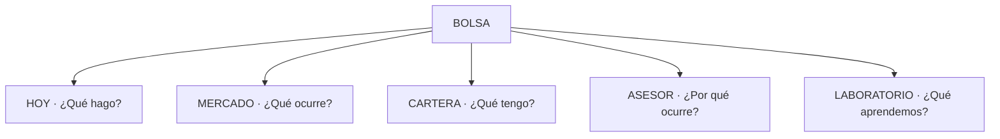
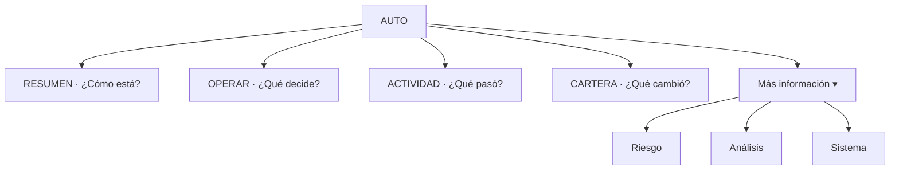
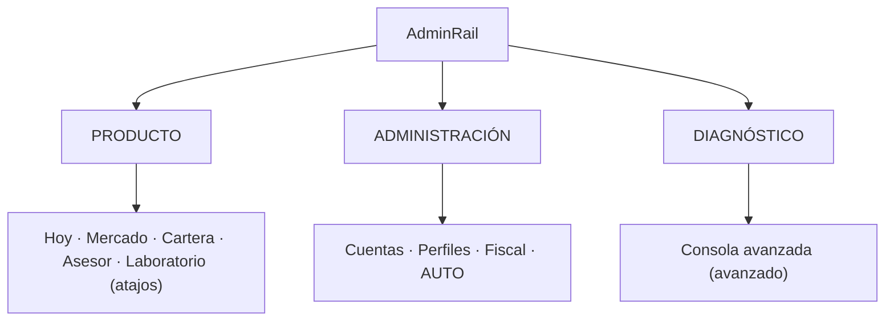

# Spec — UI Contract 5.0: **Global User-First** (contrato de UI/UX)

> **AsOf:** 2026-10-08 · **Estado:** **DISEÑO CONGELADO** (no es código).
> **Base:** tag `v2.88.87-beta` → commit `6b70da1f`, `Δ motor = 0`.
> **Padres:** [auditoría UI global v2.88.87](./auditoria-ui-global-v2.88.87-2026-10-08.md) · [spec AUTO UI definitiva](./spec-auto-ui-definitiva-2026-10-07.md) · [spec AUTO UI 3.0](./spec-auto-ui-refactor-3-0-2026-10-06.md) · [modelo semántico 1.0](./spec-auto-ui-semantic-model-1-2026-10-05.md) · [ADR-040](../adr/040-user-information-architecture.md) · [ADR-044](../adr/044-auto-workspace-information-architecture.md) · [ADR-019](../adr/019-dual-universes-lab-vs-trading.md) · [domain-language](../domain-language.md).
> **Naturaleza:** UI / producto / semántica. **`Δ motor = 0`**. Sin contrato HTTP nuevo. Sin Alembic. Sin código en este slice.

---

## 0. Propósito y alcance

Este documento **no añade funcionalidad**: fija el **contrato** que debe cumplir **toda** la aplicación para sentirse como una sola aplicación, con un único lenguaje operativo. Es la base de la fase **UI REFACTOR 5.0 — GLOBAL USER-FIRST**.

**Congela:**

- la **jerarquía de navegación** (L1, espacio AUTO, `AdminRail`);
- la **gramática universal de la operación** (escalera de peldaños) y la **insignia de modo** (`AUTO`/`SEMI`/`MANUAL`);
- los **estados** oficiales de dato (`CONFIRMADO`/`PARCIAL`/`SIN DATO TODAVÍA`/`BLOQUEADO`) y el estatus oficial de `UNKNOWN ≠ 0` y de «Sin dato todavía»;
- la **distinción Acción / Navegación / Información**;
- las reglas de **densidad** (primer nivel vs detalle técnico) y de **un término = un significado**.

**NO congela (fuera de este slice):** el motor; el worker; el contrato HTTP; la implementación de las reglas (fase posterior); la certificación `axe` (se cita la ya existente).

**Regla de compatibilidad:** mientras este contrato y el modelo semántico discrepen sobre qué es un **hecho**, **manda el modelo semántico**. Este contrato manda sobre **presentación, jerarquía, vocabulario y estados**.

---

## 1. Arquitectura de información objetivo

### 1.1 Nivel 1 — cinco puertas de producto (ADR-040, intacto)

Las cinco puertas L1 y el aterrizaje `/mesa` **no cambian**. AUTO **no** es L1 (ADR-040/044); se accede por `AdminRail` y command palette.

### 1.2 Espacio AUTO — cuatro puertas visibles + «Más información»

Las **rutas** no cambian (`/auto/riesgo`, `/auto/analisis`, `/auto/sistema` siguen existiendo y son compartibles). Lo que cambia es la **jerarquía visible**: `Riesgo`, `Análisis` y `Sistema` dejan de estar al mismo rango que las cuatro puertas principales y pasan bajo un disclosure «Más información».

### 1.3 `AdminRail` — tres grupos

`Riesgo`, `Análisis` y `Sistema` no aparecen aquí: son segundo nivel **dentro** de AUTO. No se cambian rutas; es jerarquía visual.

---

## 2. Reglas del contrato

Cada regla es **falsable**. El identificador `UI5-xx` es estable y citable.

### Bloque A — Navegación y jerarquía

| ID | Regla | Falsabilidad |
| --- | --- | --- |
| `UI5-01` | **Una pantalla = una pregunta.** El primer bloque visible responde a esa pregunta; no informa ni explica antes de responder. | Que el primer bloque de una pantalla sea un párrafo explicativo en vez de la respuesta. |
| `UI5-02` | **Cinco puertas L1 intactas** (Hoy · Mercado · Cartera · Asesor · Laboratorio); AUTO no es L1. | Que aparezca una sexta puerta L1 o AUTO como puerta en la barra superior. |
| `UI5-03` | **Nav visible de AUTO = `Resumen · Operar · Cartera · Actividad`.** `Riesgo · Análisis · Sistema` viven bajo «Más información»; sus rutas no cambian. | Que `AUTO_NAV.items` pinte las siete al mismo nivel visible. |
| `UI5-04` | **HOME de AUTO = cockpit, no informe.** Orden: estado → oportunidades → decisión → operación → dinero → enlaces. Cada hecho se pinta **una sola vez** en primer nivel. | Que el estado del motor, o las operaciones en curso, aparezcan dos veces en la HOME. |
| `UI5-05` | **«¿Qué puedo hacer?» se reserva a acciones del usuario** (o a «no necesitas hacer nada»). Las oportunidades van bajo **«Oportunidades»**, no bajo «¿Qué puedo hacer?». | Que el TOP3 cuelgue del bloque «¿Qué puedo hacer?». |
| `UI5-06` | **TOP3 en tres niveles:** resumen en HOME, completo en OPERAR, profundidad en Análisis. Sin duplicar el peso entre HOME y OPERAR. | Que HOME y OPERAR monten el mismo panel con la misma densidad. |
| `UI5-07` | **Oportunidades: `Hoy` = universo completo; `AUTO` = subconjunto que AUTO usa.** La UI lo dice explícitamente y ofrece enlace cruzado. | Que ambas listas se muestren sin copy que explique su relación. |
| `UI5-08` | **`AdminRail` en tres grupos** (`Producto` / `Administración` / `Diagnóstico`); «Consola avanzada» se conserva y queda bajo diagnóstico/avanzado. No se cambian rutas. | Que la rail siga siendo una lista plana sin grupos. |

### Bloque B — Gramática de la operación

| ID | Regla | Falsabilidad |
| --- | --- | --- |
| `UI5-09` | **Escalera universal** (heredada del modelo semántico, ahora global): `Preparada → Orden preparada`; `Enviada → Orden enviada`; `Ejecutándose → Esperando ejecución`; `Parcial → Ejecución parcial`; `Ejecutada → Ejecución completada`; `Materializada → Posición creada`; `Cerrada → Posición cerrada`. **Nunca** se salta de orden a posición sin evidencia intermedia. | Que una superficie rotule «Posición creada» sin traza de materialización. |
| `UI5-10` | **Insignia de modo obligatoria por operación:** `AUTO` · `SEMI` · `MANUAL` (y `LIVE` cuando exista), siempre con el canal de dinero (`SIMULADO`/`LIVE`). El modo **nunca** se deduce. | Que una fila de operación o la ficha no muestre el modo. |
| `UI5-11` | **`Precio aplicado ≠ posición materializada`** en toda la app (heredado de AUTO, elevado a global). | Que un fill se presente como posición creada. |
| `UI5-12` | **`Ranking ≠ decisión`** en toda la app (heredado de AUTO, elevado a global). | Que un slot del ranking se pinte como compra. |
| `UI5-13` | **Cartera única.** `AUTO / Cartera` es una **vista** de la misma cuenta, nunca una segunda cartera; cuando aplique, siempre rotulada `SIMULADA`. Se deja de decir «posiciones abiertas» cuando son posiciones de la cuenta simulada. | Que `AUTO / Cartera` mantenga estados propios independientes de la Cartera L1. |

### Bloque C — Estados y lenguaje

| ID | Regla | Falsabilidad |
| --- | --- | --- |
| `UI5-14` | **«Sin dato todavía» es el estado oficial del dato ausente.** Prohibido `0`, `—`, `N/A`, `UNKNOWN`, `No` para ese significado en primer nivel. | Que un hueco se pinte `0` o `—`. |
| `UI5-15` | **Cuatro tonos oficiales:** `CONFIRMADO` · `PARCIAL / PENDIENTE` · `SIN DATO TODAVÍA` · `BLOQUEADO` (este último solo con evidencia de bloqueo). | Que se use `BLOQUEADO` sin evidencia, o que `SIN DATO TODAVÍA` se pinte como fallo. |
| `UI5-16` | **`UNKNOWN ≠ 0`** elevado a contrato global: un hueco se declara; jamás se colapsa a cero ni a un estado verde. | Que una medición `UNKNOWN` se presente como `0` o como confirmada. |
| `UI5-17` | **Acción ≠ Navegación ≠ Información.** Acción = botón con verbo (`Comprar`/`Vender`/`Confirmar`/`Cancelar`); Navegación = enlace (`Ver operación →`); Información = chip no interactivo (`Simulado`, `Esperando ejecución`, `Sin dato todavía`). | Que un estado (`Simulado`) o un enlace se pinten como botón de acción. |
| `UI5-18` | **Riesgo human-first:** el primer nivel es un **veredicto** (`Controlado`/`Atención`/`Bloqueado` + frase); exposición, ATR, correlación, risk budget, sector y drawdown quedan en segundo nivel. | Que el primer nivel de Riesgo empiece por métricas. |
| `UI5-19` | **Sistema fuera del flujo diario:** la HOME responde «¿está funcionando AUTO?»; `Sistema` es diagnóstico, no puerta de entrada. | Que «¿funciona AUTO?» exija entrar en Sistema. |
| `UI5-20` | **Un término = un significado** en toda la app; [`domain-language.md`](../domain-language.md) es la autoridad. Sinónimos locales en primer nivel están prohibidos. | Que dos pantallas usen palabras distintas para el mismo peldaño/estado. |

---

## 3. Vocabulario oficial (resumen operativo)

| Concepto | Término permitido (primer nivel) | Prohibido |
| --- | --- | --- |
| Oportunidad rankeada | «Oportunidad» (N/100), «Estado: propuesta» | «Las mejores acciones», «compra» |
| Decisión de cartera | «AUTO ha decidido» (cuando exista el hecho) | inferirla del ranking |
| Pedido registrado | «Orden preparada» / «Orden enviada» | «ejecutada» |
| Espera de ejecución | «Esperando ejecución» | «ejecutándose» sin traza |
| Ejecución parcial | «Ejecución parcial» | «abierta» |
| Ejecución completa | «Ejecución completada» | «ejecutada» a secas |
| Materialización | «Posición creada» | «abierta» |
| Cierre | «Posición cerrada» | «ejecutada» |
| Dato ausente | «Sin dato todavía» | `0` / `—` / `N/A` / `UNKNOWN` |
| Canal de dinero | `SIMULADO` / `LIVE` | omitirlo |
| Modo de operación | `AUTO` / `SEMI` / `MANUAL` | deducirlo |

---

## 4. Densidad y niveles de lectura

Se conserva el modelo de tres niveles ya vigente en AUTO ([`auto-typography.ts`](../../apps/web/src/features/auto/auto-typography.ts)) y se eleva a contrato global:

| Nivel | Quién | Qué ve | Tipografía |
| --- | --- | --- | --- |
| 1 · usuario | usuario básico | respuesta, veredicto, frase | ≥ 14 px (`text-sm`+) |
| 2 · avanzado | usuario avanzado | componentes, motivos, contexto | plegado bajo «Más información»/«¿Por qué?» |
| 3 · auditor | auditor | `runId`, `cycleId`, `reasons` crudos, `venue` | «Detalle técnico» (10–12 px) |

**Regla dura:** una superficie de primer nivel no baja de `text-sm` y no muestra jerga de ingeniería (`TOP_N`, `cycleId`, `OpportunityScore`, `Fill`, `SETTLEMENT`, `venue`, `PAPER_D_EXECUTE`, `runId`).

---

## 5. Deuda de implementación (P0/P1/P2 → regla)

Esta spec **no implementa** nada; mapea el trabajo a las reglas. La implementación es la fase **UI REFACTOR 5.0**.

| Prioridad | Mejora | Regla | Estado |
| --- | --- | --- | --- |
| P0 | Eliminar duplicidades de la HOME de AUTO | `UI5-04` | Pendiente |
| P0 | Gramática universal de operación | `UI5-09`, `UI5-20` | Pendiente |
| P0 | Diferenciar definitivamente AUTO/SEMI/MANUAL | `UI5-10` | Pendiente |
| P1 | Simplificar navegación interna de AUTO | `UI5-03` | Pendiente |
| P1 | Unificar oportunidades Hoy vs AUTO | `UI5-07` | Pendiente |
| P1 | Simplificar Cartera (vista única, rotulada) | `UI5-13` | Pendiente |
| P1 | Primer nivel de Riesgo humano | `UI5-18` | Pendiente |
| P1 | Separar navegación de acciones | `UI5-17` | Pendiente |
| P2 | Refinar `AdminRail` | `UI5-08` | Pendiente |
| P2 | Compactar Análisis/Sistema | `UI5-19`, `UI5-03` | Pendiente |
| P2 | Revisión visual global responsive | `UI5-01`, `UI5-04` | Pendiente |

**Copy P2 a corregir en implementación** ([`auto-top3-panel.tsx`](../../apps/web/src/features/auto/auto-top3-panel.tsx) L46-48): sustituir «Las tres mejores oportunidades operables que AUTO ha detectado en el último análisis.» por «Las 3 oportunidades que AUTO ha situado en los primeros puestos de su último análisis.» (regla `UI5-06`/`UI5-07`; `ranking ≠ decisión`).

---

## 6. Falsabilidad del contrato

| # | Afirmación | Cómo se rompe |
| --- | --- | --- |
| 1 | La HOME pinta cada hecho una sola vez. | Que un hecho aparezca dos veces en el primer nivel de `/auto`. |
| 2 | La nav visible de AUTO son cuatro puertas + «Más información». | Que `auto-workspace-layout.tsx` pinte siete al mismo nivel. |
| 3 | Existe una escalera universal compartida. | Que dos superficies usen términos distintos para el mismo peldaño. |
| 4 | El modo es insignia obligatoria por operación. | Que una lista/ficha omita `AUTO/SEMI/MANUAL`. |
| 5 | `Hoy` y `AUTO` explican la relación de sus oportunidades. | Que se muestren sin copy de «universo / subconjunto». |
| 6 | «Sin dato todavía» es el único rótulo del hueco. | Que aparezca `0`/`—`/`N/A` para un dato ausente. |
| 7 | La `AdminRail` separa producto/administración/diagnóstico. | Que siga siendo una lista plana. |
| 8 | Este contrato no cambia motor ni contrato HTTP. | Que el diff toque el worker, umbrales, Alembic o `contract:gen`. |

---

## 7. Límites declarados

- **`PortfolioDecision` durable:** abierta. La ficha mantiene «¿Qué ha decidido?» en «Sin dato todavía» hasta que exista la traza; el TOP3 **no** rellena ese hueco.
- **Materialización SIM:** sin traza de apply; la ranura sigue «Sin dato todavía». La escalera no la inventa.
- **LIVE / ejecución real:** fuera de AUTO y de este contrato.
- **Implementación:** esta spec congela; el refactor se ejecuta en un slice posterior sin mover el motor.
- **Certificación `axe`:** se hereda la de `v2.88.54`/`v2.88.62`; la fase de implementación debe re-certificar las rutas tocadas.
