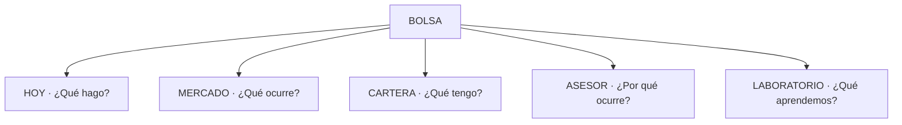
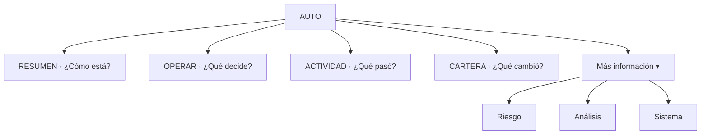
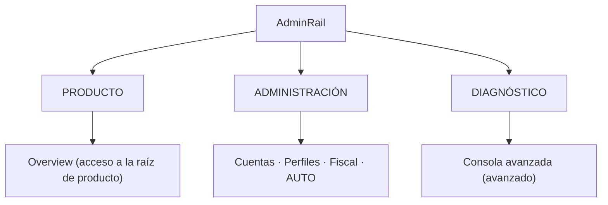

# Spec — UI Contract 5.0: **Global User-First** (contrato de UI/UX)

> **AsOf:** 2026-10-08 · **Estado:** **DISEÑO CONGELADO** + **estado de implementación** (sello 5.0 en `v2.88.88-beta` · sello `UI REFACTOR 5.1` posterior). El estado regla a regla vive en §5 (`DONE`/`PENDING`).
> **Base:** tag `v2.88.87-beta` → commit `6b70da1f`, `Δ motor = 0`.
> **Padres:** [auditoría UI global v2.88.87](./auditoria-ui-global-v2.88.87-2026-10-08.md) · [spec AUTO UI definitiva](./spec-auto-ui-definitiva-2026-10-07.md) · [spec AUTO UI 3.0](./spec-auto-ui-refactor-3-0-2026-10-06.md) · [modelo semántico 1.0](./spec-auto-ui-semantic-model-1-2026-10-05.md) · [ADR-040](../adr/040-user-information-architecture.md) · [ADR-044](../adr/044-auto-workspace-information-architecture.md) · [ADR-019](../adr/019-dual-universes-lab-vs-trading.md) · [domain-language](../domain-language.md).
> **Naturaleza:** UI / producto / semántica. **`Δ motor = 0`**. Sin contrato HTTP nuevo. Sin Alembic. Sin código en este slice.

---

## 0. Propósito y alcance

Este documento **no añade funcionalidad**: fija el **contrato** que debe cumplir **toda** la aplicación para sentirse como una sola aplicación, con un único lenguaje operativo. Es la base de la fase **UI REFACTOR 5.0 — GLOBAL USER-FIRST**.

**Congela:**

- la **jerarquía de navegación** (L1, espacio AUTO, `AdminRail`);
- la **gramática universal de la operación** (escalera de peldaños) y la **insignia de modo** (`AUTO`/`SEMI`/`MANUAL`);
- los **estados** oficiales de dato (`CONFIRMADO`/`PARCIAL`/`SIN DATO TODAVÍA`/`BLOQUEADO`) y el estatus oficial de `UNKNOWN ≠ 0` y de «Sin dato todavía»;
- la **distinción Acción / Navegación / Información**;
- las reglas de **densidad** (primer nivel vs detalle técnico) y de **un término = un significado**.

**NO congela (fuera de este slice):** el motor; el worker; el contrato HTTP; la implementación de las reglas (fase posterior); la certificación `axe` (se cita la ya existente).

**Regla de compatibilidad:** mientras este contrato y el modelo semántico discrepen sobre qué es un **hecho**, **manda el modelo semántico**. Este contrato manda sobre **presentación, jerarquía, vocabulario y estados**.

---

## 1. Arquitectura de información objetivo

### 1.1 Nivel 1 — cinco puertas de producto (ADR-040, intacto)

Las cinco puertas L1 y el aterrizaje `/mesa` **no cambian**. AUTO **no** es L1 (ADR-040/044); se accede por `AdminRail` y command palette.

### 1.2 Espacio AUTO — cuatro puertas visibles + «Más información»

Las **rutas** no cambian (`/auto/riesgo`, `/auto/analisis`, `/auto/sistema` siguen existiendo y son compartibles). Lo que cambia es la **jerarquía visible**: `Riesgo`, `Análisis` y `Sistema` dejan de estar al mismo rango que las cuatro puertas principales y pasan bajo un disclosure «Más información».

### 1.3 `AdminRail` — tres grupos

`Riesgo`, `Análisis` y `Sistema` no aparecen aquí: son segundo nivel **dentro** de AUTO. No se cambian rutas; es jerarquía visual.

**Corrección §1.3 (UI REFACTOR 5.1, opción B).** El bloque `Producto` del rail **no** duplica las cinco puertas L1: contiene los **accesos rápidos de producto disponibles** (`Overview`). Las cinco puertas (`Hoy · Mercado · Cartera · Asesor · Laboratorio`) siguen en la **barra de navegación superior (L1)** de ADR-040 y **no** se replican dentro del rail.

---

## 2. Reglas del contrato

Cada regla es **falsable**. El identificador `UI5-xx` es estable y citable.

### Bloque A — Navegación y jerarquía

| ID | Regla | Falsabilidad |
| --- | --- | --- |
| `UI5-01` | **Una pantalla = una pregunta.** El primer bloque visible responde a esa pregunta; no informa ni explica antes de responder. | Que el primer bloque de una pantalla sea un párrafo explicativo en vez de la respuesta. |
| `UI5-02` | **Cinco puertas L1 intactas** (Hoy · Mercado · Cartera · Asesor · Laboratorio); AUTO no es L1. | Que aparezca una sexta puerta L1 o AUTO como puerta en la barra superior. |
| `UI5-03` | **Nav visible de AUTO = `Resumen · Operar · Cartera · Actividad`.** `Riesgo · Análisis · Sistema` viven bajo «Más información»; sus rutas no cambian. | Que `AUTO_NAV.items` pinte las siete al mismo nivel visible. |
| `UI5-04` | **HOME de AUTO = cockpit, no informe.** Orden: estado → oportunidades → decisión → operación → dinero → enlaces. Cada hecho se pinta **una sola vez** en primer nivel. | Que el estado del motor, o las operaciones en curso, aparezcan dos veces en la HOME. |
| `UI5-05` | **«¿Qué puedo hacer?» se reserva a acciones del usuario** (o a «no necesitas hacer nada»). Las oportunidades van bajo **«Oportunidades»**, no bajo «¿Qué puedo hacer?». | Que el TOP3 cuelgue del bloque «¿Qué puedo hacer?». |
| `UI5-06` | **TOP3 en tres niveles:** resumen en HOME, completo en OPERAR, profundidad en Análisis. Sin duplicar el peso entre HOME y OPERAR. | Que HOME y OPERAR monten el mismo panel con la misma densidad. |
| `UI5-07` | **Oportunidades: `Hoy` = universo completo; `AUTO` = subconjunto que AUTO usa.** La UI lo dice explícitamente y ofrece enlace cruzado. | Que ambas listas se muestren sin copy que explique su relación. |
| `UI5-08` | **`AdminRail` en tres grupos** (`Producto` / `Administración` / `Diagnóstico`); «Consola avanzada» se conserva y queda bajo diagnóstico/avanzado. `Producto` contiene los **accesos rápidos de producto disponibles** (`Overview`), sin duplicar las cinco puertas L1 (que viven en la barra superior). No se cambian rutas. | Que la rail siga siendo una lista plana sin grupos. |
| `UI5-21` | **Modo operativo persistente (Información + Navegación, nunca acción).** El chrome expone el modo de operativa vigente (`AUTO`/`SEMI`/`MANUAL`) como un **chip-enlace** a `/auto`: informa del modo y da acceso directo al espacio AUTO. **No** es una sexta puerta L1 (`UI5-02`) y **no** cambia el modo; el cambio sigue en el libro operativo (`demo-book-mode-panel`, `UI5-17`). | Que el chip viva dentro de `nav[aria-label="Principal"]`, que cambie el modo por sí solo, o que AUTO se promocione a puerta L1. |

### Bloque B — Gramática de la operación

| ID | Regla | Falsabilidad |
| --- | --- | --- |
| `UI5-09` | **Escalera universal** (heredada del modelo semántico, ahora global): `Preparada → Orden preparada`; `Enviada → Orden enviada`; `Ejecutándose → Esperando ejecución`; `Parcial → Ejecución parcial`; `Ejecutada → Ejecución completada`; `Materializada → Posición creada`; `Cerrada → Posición cerrada`. **Nunca** se salta de orden a posición sin evidencia intermedia. | Que una superficie rotule «Posición creada» sin traza de materialización. |
| `UI5-10` | **Insignia de modo obligatoria por operación:** `AUTO` · `SEMI` · `MANUAL` (y `LIVE` cuando exista), siempre con el canal de dinero (`SIMULADO`/`LIVE`). El modo **nunca** se deduce. | Que una fila de operación o la ficha no muestre el modo. |
| `UI5-11` | **`Precio aplicado ≠ posición materializada`** en toda la app (heredado de AUTO, elevado a global). | Que un fill se presente como posición creada. |
| `UI5-12` | **`Ranking ≠ decisión`** en toda la app (heredado de AUTO, elevado a global). | Que un slot del ranking se pinte como compra. |
| `UI5-13` | **Cartera única.** `AUTO / Cartera` es una **vista** de la misma cuenta, nunca una segunda cartera; cuando aplique, siempre rotulada `SIMULADA`. Se deja de decir «posiciones abiertas» cuando son posiciones de la cuenta simulada. | Que `AUTO / Cartera` mantenga estados propios independientes de la Cartera L1. |

### Bloque C — Estados y lenguaje

| ID | Regla | Falsabilidad |
| --- | --- | --- |
| `UI5-14` | **Vocabulario de dato ausente (Opción B, enmienda UI 6.0).** Tres rótulos distintos y no intercambiables: **«Sin dato todavía»** = no medido aún; **«No aplica»** = la operación/objeto no tiene ese campo; **«No disponible»** = medido pero no accesible ahora. `—` se reserva al **nivel 3 (auditoría)** y nunca es comodín. Prohibido `0`, `N/A`, `UNKNOWN`, `No` para ese significado en primer nivel. | Que un hueco se pinte `0`, `—` o `N/A`; o que «Sin dato todavía», «No aplica» y «No disponible» se usen como sinónimos. |
| `UI5-15` | **Cuatro tonos oficiales:** `CONFIRMADO` · `PARCIAL / PENDIENTE` · `SIN DATO TODAVÍA` · `BLOQUEADO` (este último solo con evidencia de bloqueo). | Que se use `BLOQUEADO` sin evidencia, o que `SIN DATO TODAVÍA` se pinte como fallo. |
| `UI5-16` | **`UNKNOWN ≠ 0`** elevado a contrato global: un hueco se declara; jamás se colapsa a cero ni a un estado verde. | Que una medición `UNKNOWN` se presente como `0` o como confirmada. |
| `UI5-17` | **Acción ≠ Navegación ≠ Información.** Acción = botón con verbo (`Comprar`/`Vender`/`Confirmar`/`Cancelar`); Navegación = enlace (`Ver operación →`); Información = chip no interactivo (`Simulado`, `Esperando ejecución`, `Sin dato todavía`). | Que un estado (`Simulado`) o un enlace se pinten como botón de acción. |
| `UI5-18` | **Riesgo human-first:** el primer nivel es un **veredicto** (`Controlado`/`Atención`/`Bloqueado` + frase); exposición, ATR, correlación, risk budget, sector y drawdown quedan en segundo nivel. | Que el primer nivel de Riesgo empiece por métricas. |
| `UI5-19` | **Sistema fuera del flujo diario:** la HOME responde «¿está funcionando AUTO?»; `Sistema` es diagnóstico, no puerta de entrada. | Que «¿funciona AUTO?» exija entrar en Sistema. |
| `UI5-20` | **Un término = un significado** en toda la app; [`domain-language.md`](../domain-language.md) es la autoridad. Sinónimos locales en primer nivel están prohibidos. | Que dos pantallas usen palabras distintas para el mismo peldaño/estado. |

### Bloque D — Densidad y explicación (enmienda UI 6.0)

Elevadas a contrato desde el [Mapa de problemas UI 5.0](./auditoria-ui-5-0-mapa-problemas-2026-10-08.md) §7.

| ID | Regla | Falsabilidad |
| --- | --- | --- |
| `RT-01` | **Densidad.** Si un dato no cambia lo que el usuario debe hacer **ahora**, no ocupa el primer nivel. | Que un dato secundario compita en el primer nivel. |
| `RT-02` | **Explicación.** La aplicación explica el **resultado del sistema**, no cómo está construido el sistema. | Que la UI muestre arquitectura interna (`runId`, `cycleId`, `heartbeat`, `ledger`, `fill`, `provenance`) en primer nivel. |
| `RT-03` | **Dos lecturas.** Si un usuario básico puede interpretar una pantalla de dos formas distintas, la pantalla todavía no está terminada. | Que un mismo hecho se pinte de dos maneras contradictorias (p. ej. «Controlado» + cuatro huecos sin explicar). |
| `RT-04` | **Un solo mecanismo de profundidad.** Todo lo avanzado vive detrás de «Más información» / «¿Por qué?» / «Detalle técnico»; no hay disclosures paralelos con etiquetas distintas. | Que coexistan «Detalle técnico», «Detalles avanzados», «Ajustes avanzados» y «Más detalle (avanzado)» como idioms distintos. |

### Bloque E — Reglas globales de lenguaje (enmienda UI 6.x, 2026-10-08)

Elevadas a contrato desde la [auditoría UI 6.x global](./auditoria-ui-6-x-global-2026-10-08.md). **No son una regla nueva de producto: son la formulación falsable** del principio de ADR-045 (§1) y del solape ya existente `UI5-01`/`RT-02`, ahora exigible en **todas** las superficies (no solo AUTO).

| ID | Regla | Falsabilidad |
| --- | --- | --- |
| `R-G1` | **Una pantalla se entiende sin conocer cómo está construido el backend.** En el nivel 1 (usuario) no aparece arquitectura interna: identificadores de modelo (`Recommendation`, `DecisionSession`, `Policy Gate`, `OpportunityScore`), de ejecución (`runId`, `cycleId`, `PAPER_D_EXECUTE`, `settlement`) ni de almacén (`ledger`, `fills`, `DÍA-D`, `WFE`/`PBO`/`DSR`, `campaignId`). Esa jerga solo vive dentro del disclosure único (nivel 3). | Que un literal de la lista §8 de la auditoría aparezca en el DOM de primer nivel de una pantalla auditada. |
| `R-G2` | **Cada pantalla responde una sola pregunta principal.** El primer bloque visible responde esa pregunta antes de explicar mecanismo; preguntas competidoras bajan de nivel. Mapa: Hoy `¿Qué requiere mi atención?` · Mercado `¿Qué está ocurriendo?` · Cartera `¿Qué tengo?` · Asesor `¿Por qué?` · Laboratorio `¿Qué estamos aprendiendo?` · AUTO `¿Qué está haciendo AUTO?` · Confirmar `¿Qué voy a autorizar?`. | Que el primer bloque de una pantalla explique cómo funciona el sistema en vez de responder su pregunta. |

**Solape declarado:** `R-G1` refina `RT-02` (explicación) y `R-G2` refina `UI5-01` (una pantalla = una pregunta). Donde discrepen, `R-G1`/`R-G2` **no sustituyen** a `UI5-01`/`RT-02`: los hacen **válidos para toda la app**, no solo para AUTO. El mecanismo único de profundidad sigue siendo `RT-04` (`TechnicalDetail`, rótulo «Detalle técnico»).

---

## 3. Vocabulario oficial (resumen operativo)

| Concepto | Término permitido (primer nivel) | Prohibido |
| --- | --- | --- |
| Oportunidad rankeada | «Oportunidad» (N/100), «Estado: propuesta» | «Las mejores acciones», «compra» |
| Decisión de cartera | «AUTO ha decidido» (cuando exista el hecho) | inferirla del ranking |
| Pedido registrado | «Orden preparada» / «Orden enviada» | «ejecutada» |
| Espera de ejecución | «Esperando ejecución» | «ejecutándose» sin traza |
| Ejecución parcial | «Ejecución parcial» | «abierta» |
| Ejecución completa | «Ejecución completada» | «ejecutada» a secas |
| Materialización | «Posición creada» | «abierta» |
| Cierre | «Posición cerrada» | «ejecutada» |
| Dato ausente | «Sin dato todavía» (no medido) · «No aplica» · «No disponible» | `0` / `N/A` / `UNKNOWN` / `—` en nivel 1 |
| Canal de dinero | `SIMULADO` / `LIVE` | omitirlo |
| Modo de operación | `AUTO` / `SEMI` / `MANUAL` | deducirlo |

---

## 4. Densidad y niveles de lectura

Se conserva el modelo de tres niveles ya vigente en AUTO ([`auto-typography.ts`](../../apps/web/src/features/auto/auto-typography.ts)) y se eleva a contrato global:

| Nivel | Quién | Qué ve | Tipografía |
| --- | --- | --- | --- |
| 1 · usuario | usuario básico | respuesta, veredicto, frase | ≥ 14 px (`text-sm`+) |
| 2 · avanzado | usuario avanzado | componentes, motivos, contexto | plegado bajo «Más información»/«¿Por qué?» |
| 3 · auditor | auditor | `runId`, `cycleId`, `reasons` crudos, `venue` | «Detalle técnico» (10–12 px) |

**Regla dura:** una superficie de primer nivel no baja de `text-sm` y no muestra jerga de ingeniería (`TOP_N`, `cycleId`, `OpportunityScore`, `Fill`, `SETTLEMENT`, `venue`, `PAPER_D_EXECUTE`, `runId`).

---

## 5. Deuda de implementación (P0/P1/P2 → regla)

Esta spec **congela**; el estado de implementación se anota aquí regla a regla. El **sello 5.0** (`v2.88.88-beta`) implementó la estructura; el **sello `UI REFACTOR 5.1`** remata la densidad de la HOME y de Riesgo y cierra la decisión de `AdminRail`. `DONE` = regla implementada y falsable por test; `PENDING` = trabajo vivo.

| Prioridad | Mejora | Regla | Estado |
| --- | --- | --- | --- |
| P0 | Eliminar duplicidades de la HOME de AUTO | `UI5-04` | **DONE** (5.0/5.1; **UI 6.0 P0-A**: un solo chip `SIMULACIÓN — DINERO VIRTUAL`, un solo hueco declarado, «Ver todas las operaciones» fuera de Oportunidades, copy «qué puedes hacer» retirado) |
| P0 | Gramática universal de operación | `UI5-09`, `UI5-20` | **DONE** (**UI 6.0 P0-C**: `Confirm` renderiza la escalera LIVE VIRTUAL en español; tokens `proposed/signed/submitted/filled*/rejected/not_wired` fuera del DOM; cierre sin medición `COMPLETE` ya no salta a «Posición cerrada`) |
| P0 | Diferenciar definitivamente AUTO/SEMI/MANUAL | `UI5-10` | **DONE** (**UI 6.0 P1-F**: `ModeBadge` obligatoria en cada fila de Mesa vía `operationModeForPosition(pos, "market")`; `OPERATION_MODE_LABEL` como única fuente de casing) |
| P1 | Simplificar navegación interna de AUTO | `UI5-03` | **DONE** |
| P1 | Unificar oportunidades Hoy vs AUTO | `UI5-07` | **DONE** |
| P1 | Simplificar Cartera (vista única, rotulada) | `UI5-13` | **DONE** |
| P1 | Primer nivel de Riesgo humano | `UI5-18` | **DONE** (5.1; **UI 6.0 P0-B**: un veredicto + una frase + **un** único hueco declarado; campos solo con valor real) |
| P1 | Separar navegación de acciones | `UI5-17` | **DONE** (**UI 6.0 P1-E**: retirado el stub `Estadísticas · pronto` del `AdminRail`) |
| P2 | Refinar `AdminRail` | `UI5-08` | **DONE** (5.1 + **UI 6.0 P1-E**: tres grupos, sin stubs; `Consola avanzada` bajo Diagnóstico; ayuda sincronizada) |
| P2 | Compactar Análisis/Sistema | `UI5-19` | **DONE** (**UI 6.0 A1**: `/auto/sistema` deja de re-espejar el estado+reloj de la HOME en su primer bloque (vive dentro de `AutoTechnicalDetail`); `/auto/analisis` pliega `DÍA-D · feedback OOS` tras `Detalle técnico` con rótulo humano; `operar.description` deja de prometer acción) |
| P2 | Revisión visual global responsive | `UI5-01` | **DONE** (**Oleada B**: nuevo [`gp-e2e-ui5-0-axe-touched-routes-mock.spec.ts`](../../apps/web/e2e/gp-e2e-ui5-0-axe-touched-routes-mock.spec.ts) barre `/trading`, `/mesa`, `/mesa?view=posiciones`, `/confirm` y la command palette a 1366×768 y 390×844 con `axe-core` WCAG 2.0/2.1 A+AA → **0 `critical`/`serious`**, un único `main`+`h1`; fixes AA de contraste, `aria-label` de listbox, `<dt>` en `<dl>` `sr-only` y `tabIndex` de scroll) |
| P0 | Vocabulario de dato ausente (Opción B) | `UI5-14` | **DONE** (**UI 6.0 P0-D**: helper [`absent-data.ts`](../../apps/web/src/components/absent-data.ts); primer nivel sin `—` en operaciones, barra de estado e historial) |
| P0 | Densidad · explicación · dos lecturas · un solo detalle | `RT-01`…`RT-04` | **DONE** (**UI 6.0 P1-G + P2**: jerga (`ledger`, `fills`, `trials`, `WFE/PBO/DSR`, JSON crudo) plegada tras **`Detalle técnico`**; idioma único) |
| P0 | Una pantalla se entiende sin el backend | `R-G1` | **DONE** (**UI 6.x, `2.11.91-beta`**: alcance global — Confirmar · Hoy · Cartera · Mercado · Asesor; jerga (modelo/sesión, `runId`/`cycleId`, `ledger`/`fills`, `DÍA-D`, `WFE/PBO/DSR`) plegada tras el disclosure único; gate falsable [`first-level-gate.ts`](../../apps/web/src/components/first-level-gate.ts)) |
| P0 | Una pantalla = una pregunta (global) | `R-G2` | **DONE** (**UI 6.x, `2.11.91-beta`**: primer bloque responde la pregunta de la pantalla en Hoy · Mercado · Cartera · Asesor · AUTO · Confirmar) |
| P1 | Una sola puerta L1 activa · un solo `h1` de Mercado | `UI5-01`, `UI5-04`, `UI5-20` | **DONE** (**UI 6.0 P1-E/P2**: `Cartera` cede `Hoy` en `?view=posiciones`; elimina doble `h1` `Trading`/`Mercado`) |
| P1 | Modo operativo persistente (acceso a AUTO sin sexta puerta) | `UI5-21` | **DONE** (**UI 7.0**: chip-enlace `Operativa · AUTO/SEMI/MANUAL` en la barra superior, fuera de `nav[aria-label="Principal"]`; enlaza a `/auto`; no cambia el modo) |

**Enmienda UI 6.0 (2026-10-08) — implementada.** El [Mapa de problemas UI 5.0](./auditoria-ui-5-0-mapa-problemas-2026-10-08.md) fijó el trabajo y el [plan único UI 6.0](./plan-ui-6-0-2026-10-08.md) lo ordenó en slices: **P0-A** HOME cockpit · **P0-B** Riesgo human-first · **P0-C** una sola escalera · **P0-D** `Sin dato todavía` global · **P1-E** navegación/L1 · **P1-F** modo/canal · **P1-G** lenguaje humano · **P2** pulido. Las reglas `RT-01`…`RT-04` (Bloque D) y el vocabulario Opción B (`UI5-14`) quedan implementados y falsables por test. Cierre medido: `typecheck` OK · `lint` 0 errores (23 avisos preexistentes) · `pnpm --filter @bolsa/web test` **271 ficheros / 1625 passed** · `axe` AUTO **14/14** + `axe` rutas tocadas **9/9** + `live-virtual-confirm` **2/2** · `Δ motor = 0`.

**Enmienda UI 6.x (2026-10-08) — implementada.** La [auditoría UI 6.x global](./auditoria-ui-6-x-global-2026-10-08.md) elevó a contrato las dos reglas globales del **Bloque E**: `R-G1` («una pantalla se entiende sin el backend») y `R-G2` («una pantalla = una pregunta»). El **disclosure único** `RT-04` se materializa en [`technical-detail.tsx`](../../apps/web/src/components/technical-detail.tsx) (rótulo `Detalle técnico`, marca `data-technical-detail`), con un **gate falsable** compartido ([`first-level-gate.ts`](../../apps/web/src/components/first-level-gate.ts)) que falla si la jerga de la lista §8 aparece fuera de nivel 3. Alcance: Confirmar (P0), Hoy (P1) y las superficies de las oleadas 2-6. Cierre medido en `2.11.91-beta`: `typecheck` OK · `lint` 0 errores (23 avisos preexistentes) · `pnpm --filter @bolsa/web test` **276 ficheros / 1662 passed** · `axe` rutas L1 **13/13** (incl. `heading-order` 0) + `live-virtual-confirm` **2/2** · `Δ motor = 0`.

**Cierre del backlog UI 5.0 (Oleada A/B).** Se cierran los hallazgos abiertos del Mapa de problemas UI 5.0. (1) `UI5-09`: un cierre con `closedMeasurement === "COMPLETE"` sigue resolviendo `Posición cerrada` sin exigir traza de materialización intermedia (coherente con el modelo durable y el contrato backend); se cerró el bug de evidencia fabricada (`?? "COMPLETE"`) y el peldaño `Salida final` de la cabina deriva su estado de evidencia (`remainingPct`) declarando hueco sin traza. (2) `account-venue-preference.tsx` conserva un literal `submitted ≠ fill` fuera del alcance de los slices. (3) `mesa-candidates-panel` conserva `Gate N` como dato de decisión (no es término prohibido).

**Copy P2 (DONE).** [`auto-top3-panel.tsx`](../../apps/web/src/features/auto/auto-top3-panel.tsx): «Las 3 oportunidades que AUTO ha situado en los primeros puestos de su último análisis.» (regla `UI5-06`/`UI5-07`; `ranking ≠ decisión`).

---

## 6. Falsabilidad del contrato

| # | Afirmación | Cómo se rompe |
| --- | --- | --- |
| 1 | La HOME pinta cada hecho una sola vez. | Que un hecho aparezca dos veces en el primer nivel de `/auto`. |
| 2 | La nav visible de AUTO son cuatro puertas + «Más información». | Que `auto-workspace-layout.tsx` pinte siete al mismo nivel. |
| 3 | Existe una escalera universal compartida. | Que dos superficies usen términos distintos para el mismo peldaño. |
| 4 | El modo es insignia obligatoria por operación. | Que una lista/ficha omita `AUTO/SEMI/MANUAL`. |
| 5 | `Hoy` y `AUTO` explican la relación de sus oportunidades. | Que se muestren sin copy de «universo / subconjunto». |
| 6 | «Sin dato todavía» es el único rótulo del hueco. | Que aparezca `0`/`—`/`N/A` para un dato ausente. |
| 7 | La `AdminRail` separa producto/administración/diagnóstico. | Que siga siendo una lista plana. |
| 8 | Este contrato no cambia motor ni contrato HTTP. | Que el diff toque el worker, umbrales, Alembic o `contract:gen`. |
| 9 | Ninguna pantalla auditada muestra arquitectura interna en primer nivel. | Que un literal de la lista §8 (p. ej. `Recommendation`, `ledger`, `fills`, `runId`) se renderice fuera de `Detalle técnico`. |
| 10 | Cada pantalla responde su pregunta principal antes de explicar mecanismo. | Que el primer bloque visible de una pantalla explique cómo funciona el sistema en vez de responder su pregunta. |
| 11 | El nivel 3 usa un único disclosure con rótulo «Detalle técnico». | Que coexistan idioms de profundidad (`Ajustes avanzados`, `Más detalle`) fuera de `TechnicalDetail`. |

---

## 7. Límites declarados

- **`PortfolioDecision` durable:** abierta. La ficha mantiene «¿Qué ha decidido?» en «Sin dato todavía» hasta que exista la traza; el TOP3 **no** rellena ese hueco.
- **Materialización SIM:** sin traza de apply; la ranura sigue «Sin dato todavía». La escalera no la inventa.
- **LIVE / ejecución real:** fuera de AUTO y de este contrato.
- **Implementación:** esta spec congela; el refactor se ejecuta en un slice posterior sin mover el motor.
- **Certificación `axe`:** se hereda la de `v2.88.54`/`v2.88.62`; la fase de implementación debe re-certificar las rutas tocadas.
