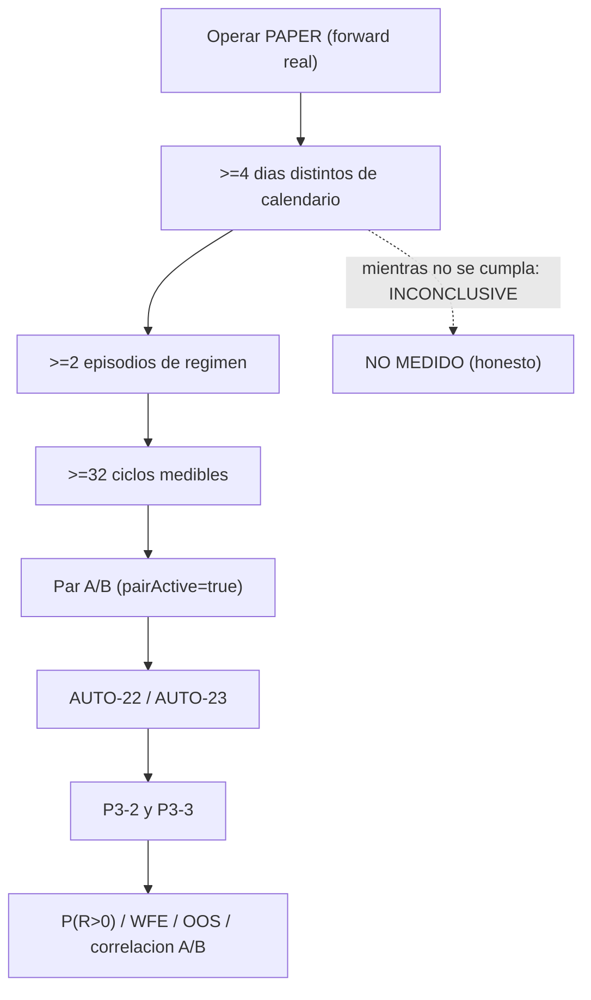

# Traspaso / relevo — post `v2.82` / `AUTO-MATERIAL-10`: OBSERVATION WINDOW (fase operativa)

> **AsOf:** 2026-09-27 · **Estado:** fase **CERRADA** (`2.07.0-beta`, tag `v2.82-beta`), pendiente de
> **auditoría externa**. **Alembic head:** `046_fill_reference_mid` (**SIN migración**).

## 1. Resumen de una línea

`v2.82` es un **marcador de fase operativo**: formaliza el paso que la auditoría de `v2.81` dejó como
**operación del propietario** —la **ventana ≥4 días**— y **no** añade código (el único cambio no-doc es
`package.json`). El instrumento de observación (funnel + `unresolved_age` + HTML) queda **intacto**; la
evidencia la produce el **forward real** de mercado.

## 2. Ficheros entregados

| Fichero | Qué |
|---|---|
| `package.json` | `2.06.0-beta → 2.07.0-beta` (**único** cambio no-doc) |
| `docs/engineering/plan-v2-82-auto-material-10-observation-window-2026-09-27.md` | plan de la fase operativa + escalera de éxito |
| `docs/engineering/audit-pack-v2-82-auto-material-10-observation-window-2026-09-27.md` | audit-pack declarativo (fase docs-only) |
| `docs/engineering/arranque-auditor-v2-82-…md` · `arranque-agente-v2-82-…md` | entradas de auditor y agente |
| `docs/engineering/traspaso-relevo-post-v2-82-…md` | este relevo |
| `docs/engineering/evidencia-ci-tag-v2.82-2026-09-27.txt` | CI del tag (POST-TAG) |

**No se toca** ningún módulo de motor, instrumento o workflow.

## 3. Cómo correr la ventana (operación del propietario)

```powershell
# 1) Forward diario real (>=4 dias) con el runbook:
#    docs/engineering/runbook-ventana-forward-v2.78-2026-09-27.md

# 2) Serie diaria + funnel + informe HTML desde el journal durable (read-only):
$env:BROKER_VENUE="paper"
uv run --no-sync python apps/api-python/scripts/v2_80_market_window.py `
    --account-id "$ACCOUNT" --strategy-version "$VERSION_A" --days 4 --render `
    --forward 'operability_runs/forward-market-*.json' `
    --out operability_runs/operability-window.json `
    --html operability_runs/operability-window.html
```

Repite la cadencia del runbook **cada día de mercado**. Los artefactos viven en `operability_runs/`
(**no versionado**).

## 4. Escalera de éxito y lectura



- **Funnel:** `universe → marketData → regimeAllowed → signals → topN → risk → reservation → orders →
  fills → cycles` localiza el escalón donde se pierde la oportunidad.
- **`unresolved_age`:** `gt20m` frecuente delata un problema de **integración**, no de mercado.
- Un hueco se declara `n/d` (**None**), **nunca** `0`; el veredicto sin ventana es `INCONCLUSIVE`.

## 5. Deuda y próximo paso

- **`P3-2`/`P3-3` ABIERTAS:** sólo se cierran con la **ventana ≥4 días** real (`AUTO-22`/`AUTO-23`).
- **`H-4` (LOW) ABIERTO:** su cierre formal es **después** de la primera ventana; el funnel y
  `reasonCatalogCoverage` lo hacen **visible**.
- **`resolutionJoined=false`**, **fila TOTAL**, **`P3-5`** y **`OBS-5`**: declaradas, sin abordar.

## 6. Reglas duras (no negociables)

Freeze del worker y del gobernador intactos; `TOP_N` y umbrales intactos; **sin migración**; reparto
`auto18-v1`/`auto15-v1`; **forward, no replay**; capturador **read-only**; veredicto honesto
`INCONCLUSIVE`/`NO MEDIDO` si la ventana está degenerada.
