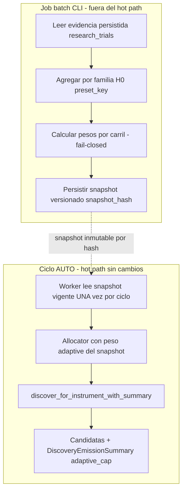

# RELEVO — v2.36 · Strategy Intelligence adaptativa (incremento 1: carril `adaptive`) — 2026-09-11

> **Para el agente entrante (con sus subagentes).** Este documento es autocontenido: asume
> **cero contexto previo** más allá de lo que aquí se dice. Léelo entero antes de tocar nada.
> Respeta el estilo del repo: español, fail-closed, sin LLM en hot path, LIVE congelado.
>
> **AsOf:** 2026-09-11 · **Base:** `main` · padre `5348bee0` (sello `v2.35.1-beta`).
> **Alembic head:** `036_discovery_evidence_snapshots` (migración aditiva nueva).
> **Veredicto:** incremento 1 **IMPLEMENTADO, ELEVADO y verificado**. `main == cb147d89` ==
> tag **`v2.36-beta`**; **Release-tag CI GREEN VERIFICADO** (run `34604803938`, conclusión
> `success`, 2026-09-11): `python`, `lifecycle-pg`, `dr-verify`, `a7-gate`, `security`,
> `decision-spine`, `shared`, `frontend`, `playwright (mock E2E)` y `certify` en verde.
> El flag `AUTO_ORCHESTRATOR_ADAPTIVE_ALLOCATOR` queda **OFF por defecto**: con OFF el
> sistema es byte-idéntico a `v2.35.1-beta`.
> **Bump:** `1.60.1-beta` → `1.61.0-beta`.

---

## 0. Estado en una frase

Se cierra la **primera mitad** del bucle `evidence → aprender → ajustar búsqueda`: el carril
`adaptive` del `DiscoveryBudgetAllocator` (hasta ahora peso `0.0`, un hueco semántico) deja de
ser un placeholder y se alimenta de un **snapshot de evidencia inmutable, determinista y
versionado**, calculado fuera del hot path por un job batch/CLI e **inyectado** en el worker.
El discovery sigue siendo una **función pura dada `(instrument_id, snapshot)`**.

**Alcance explícito (no confundir):** el incremento 1 asigna **cupo real y observable** al
carril adaptativo; **NO** añade espacio de búsqueda nuevo ni emisión adaptativa nueva. Eso es el
incremento 2. Catálogo, gramática simple y gramática compuesta quedan intactos.

---

## 1. Diagrama del bucle



---

## 2. Qué se ha implementado (mapa fichero → responsabilidad)

| Capa       | Fichero                                                                                                               | Responsabilidad                                                                                                                                    |
| ---------- | --------------------------------------------------------------------------------------------------------------------- | -------------------------------------------------------------------------------------------------------------------------------------------------- |
| Dominio    | `packages/py/domain/src/bolsa_domain/entities/discovery_evidence_snapshot.py`                                         | Entidad `DiscoveryEvidenceSnapshot` (frozen/slots) + `MATH_VERSION_DISCOVERY_EVIDENCE_V0` + `adaptive_weight()`/`has_evidence()`.                  |
| Dominio    | `packages/py/domain/src/bolsa_domain/repositories/discovery_evidence_snapshot_repository.py`                          | Contrato `DiscoveryEvidenceSnapshotRepository` (`save`/`get_latest`/`get_by_hash`/`list_recent`).                                                  |
| Dominio    | `packages/py/domain/src/bolsa_domain/repositories/research_trial_repository.py`                                       | Método de lectura agregada nuevo `family_evidence_summary` + `latest_trial_at`.                                                                    |
| Aplicación | `packages/py/application/src/bolsa_application/discovery_evidence.py`                                                 | Builder determinista: `build_discovery_evidence_snapshot`, `compute_family_weights`, `compute_lane_weights`, `snapshot_hash`. Fail-closed y cotas. |
| Infra      | `packages/py/infrastructure/src/bolsa_infrastructure/database/models/tables.py`                                       | `DiscoveryEvidenceSnapshotRow` (+ export en `models/__init__.py`).                                                                                 |
| Infra      | `packages/py/infrastructure/src/bolsa_infrastructure/database/repositories/research_trial_repository.py`              | Implementación SQL de `family_evidence_summary` (`case`/`sum` por `preset_key`, orden canónico).                                                   |
| Infra      | `packages/py/infrastructure/src/bolsa_infrastructure/database/repositories/discovery_evidence_snapshot_repository.py` | Repo SQL, inmutable por hash (`save` idempotente).                                                                                                 |
| Infra      | `packages/py/infrastructure/alembic/versions/036_discovery_evidence_snapshots.py`                                     | Migración aditiva, `down_revision=035_paper_forward_evidence`, guards idempotentes, `downgrade()` completo.                                        |
| App        | `apps/api-python/scripts/build_discovery_evidence_snapshot.py`                                                        | Job batch/CLI idempotente por hash, `--dry-run`, corte `window_to` dato-dependiente.                                                               |
| App        | `apps/api-python/src/bolsa_api/background/auto_orchestrator_worker.py`                                                | Flag `AUTO_ORCHESTRATOR_ADAPTIVE_ALLOCATOR`, provider de snapshot, refresh por ciclo, inyección en el allocator.                                   |

---

## 3. Decisiones cerradas (y su porqué)

1. **Dónde aprende**: en el allocator, no en el motor. Snapshot determinista inyectado. El
   motor no consulta la BD ni el reloj: `discover_for_instrument` es puro.
2. **Alcance**: SOLO el carril `adaptive`. Catálogo y gramática simple/compuesta intactos.
3. **Ponderación por familia H0** (`preset_key`): sin tocar la escritura de trials (sin
   persistir `lane`/`grammar_plan`, sin migración de escritura).
4. **Snapshot versionado y persistido** en tabla nueva, generado por job batch/CLI. El worker
   **solo lo lee** (fail-closed si no hay snapshot vigente → `adaptive` a 0).
5. **Idempotencia real por hash**: el corte temporal por defecto es el `created_at` del trial
   más reciente (dato-dependiente, **no** el reloj). Dos ejecuciones sobre la misma evidencia
   dan el mismo `snapshot_hash` y la segunda no reescribe. (Con el reloj como corte, cada
   ejecución producía un hash distinto: se detectó y corrigió.)
6. **Fail-closed por muestra mínima**: `min_samples=3` por familia y `min_total_samples=12`
   globales antes de habilitar el carril. Una familia con 1 trial afortunado no domina el
   reparto (multiple testing documentado).
7. **Cota del prior**: peso adaptativo acotado a `[0, 0.5]` (`max_adaptive_weight`), para no
   dejar sin presupuesto a catálogo/gramática por una racha de suerte.

---

## 4. Fórmula del peso adaptativo (auditable)

- Fuerza por familia: `strength = clamp(avgScore, 0, 1) * (trials - fallos) / trials`, donde
  `fallos = zeroTrade + failures` (trials sin operaciones o con `fail_code`).
- `mean_strength` = media de fuerzas de las familias con `trials >= min_samples`.
- `adaptive_weight = clamp(mean_strength * max_adaptive_weight, 0, max_adaptive_weight)`.
- Sin familias con señal o con muestra total `< min_total_samples` ⇒ `adaptive_weight = 0.0`.
- `math_version = "discovery_evidence_v0"` permite reproducir/auditar la fórmula; el hash
  cubre además ventana, pesos por familia, pesos por carril y tamaños de muestra.

---

## 5. Invariantes respetadas

- `AUTO ⇒ SIMULATED`; **LIVE bloqueado**; **sin LLM en hot path**; fail-closed; long-only.
- H1 (`require_holdout=True` inviolable) y H2 (identidad de dataset) intactos.
- Gates CPCV/PBO/DSR/WFE/OOS + coach sin relajar.
- Test anti-explosión `len(plans) == 1784` intacto **sin cambios**.
- Con el flag OFF, todo es **byte-idéntico a v2.35.1** (no se lee la BD de snapshots).

---

## 6. Verificación ejecutada (tres bloques, local)

```
# Bloque 1 — estático
uv run ruff check packages/py apps/api-python --config pyproject.toml          # All checks passed
uv run lint-imports --config packages/py/.importlinter                          # 4 kept, 0 broken
uv run mypy packages/py/domain/src packages/py/market/src \
  packages/py/infrastructure/src packages/py/application/src apps/api-python/src \
  --follow-imports=silent                                                       # Success: 474 files

# Bloque 2 — offline
uv run pytest packages/py/domain/tests packages/py/application/tests \
  apps/api-python/tests/test_auto_orchestrator_worker.py -q                     # 1518 passed

# Bloque 3 — PG con gates
$env:A14_GRAMMAR_PG_REQUIRED="1"; $env:LIFECYCLE_PG_REQUIRED="1"; $env:AUTO_ORCHESTRATOR_PG_REQUIRED="1"
uv run pytest apps/api-python/tests/test_a11_discovery_to_auto_sim_pg.py \
  apps/api-python/tests/test_a14_grammar_discovery_pg.py \
  apps/api-python/tests/test_discovery_evidence_snapshot_pg.py -q               # 10 passed
uv run pytest apps/api-python/tests/test_discovery_evidence_snapshot_pg.py -q   # 6 passed
uv run pytest apps/api-python/tests/test_strategy_lifecycle_pg.py -q            # 57 passed
```

Job batch (manual, contra PG local):

```
uv run --project apps/api-python python \
  apps/api-python/scripts/build_discovery_evidence_snapshot.py --dry-run        # fail-closed 0.0 sin evidencia
uv run --project apps/api-python python \
  apps/api-python/scripts/build_discovery_evidence_snapshot.py                  # persisted=true
# 2.ª ejecución sobre la misma evidencia: persisted=false, mismo snapshotHash
```

---

## 7. Tabla afirmación → código → test

| #   | Afirmación                                            | Código                                    | Test                                                                                                          |
| --- | ----------------------------------------------------- | ----------------------------------------- | ------------------------------------------------------------------------------------------------------------- |
| 1   | Misma evidencia ⇒ mismo hash y pesos                  | `discovery_evidence.py::snapshot_hash`    | `test_discovery_evidence.py::test_same_evidence_yields_same_hash_and_weights`                                 |
| 2   | El hash es orden-insensible                           | `compute_family_weights` (orden canónico) | `test_family_order_does_not_change_hash`, `test_snapshot_hash_is_stable_across_equivalent_dicts`              |
| 3   | Sin evidencia ⇒ `adaptive=0.0` (fail-closed)          | `compute_lane_weights`                    | `test_no_evidence_yields_zero_adaptive_weight`, `test_families_below_min_samples_do_not_enable_lane`          |
| 4   | Peso acotado                                          | `compute_lane_weights` (clamp)            | `test_adaptive_weight_is_bounded_by_max`                                                                      |
| 5   | El carril recibe cupo real sin romper el global       | `DiscoveryBudgetAllocator.allocate`       | `test_allocator_gives_adaptive_lane_a_real_quota_without_breaking_global`                                     |
| 6   | Flag OFF por defecto                                  | `adaptive_allocator_enabled`              | `test_adaptive_allocator_defaults_off`                                                                        |
| 7   | El snapshot manda sobre el env; ausente env ⇒ 0       | `_discovery_allocator`                    | `test_allocator_snapshot_overrides_env_weight`, `test_allocator_snapshot_without_adaptive_key_is_fail_closed` |
| 8   | Una lectura por ciclo (no por instrumento)            | `_refresh_adaptive_snapshot` + bucle      | `test_loop_reads_adaptive_snapshot_once_per_cycle`                                                            |
| 9   | Sin provider no se toca la BD                         | `start_auto_orchestrator`                 | `test_loop_without_provider_does_not_touch_snapshot`                                                          |
| 10  | Provider que falla ⇒ fail-closed, sin tumbar el ciclo | `_refresh_adaptive_snapshot`              | `test_refresh_adaptive_snapshot_fail_closed_on_provider_error`                                                |
| 11  | Migración aditiva up/down limpia                      | `036_discovery_evidence_snapshots.py`     | `test_discovery_evidence_snapshot_pg.py::test_migration_036_roundtrip`                                        |
| 12  | `save` idempotente por hash                           | repo SQL                                  | `test_save_is_idempotent_by_hash`                                                                             |
| 13  | `get_latest`/`get_by_hash` correctos                  | repo SQL                                  | `test_get_by_hash_and_latest`                                                                                 |
| 14  | Agregación por familia determinista y ordenada        | `family_evidence_summary`                 | `test_family_evidence_summary_aggregates_by_preset`                                                           |
| 15  | Job idempotente por hash                              | `build_discovery_evidence_snapshot.py`    | `test_batch_job_is_idempotent_by_hash` + ejecución manual                                                     |

---

## 8. Riesgos y salvaguardas

- **Multiple testing**: ponderar por evidencia observada puede sobreajustar el presupuesto a
  familias con suerte. Salvaguarda: ventana temporal acotada, muestra mínima (por familia y
  total) y `adaptive_width` acotado; el sesgo queda documentado aquí y en el CHANGELOG.
- **Sobre-ingeniería del "learning"**: se evita bandit online y cualquier no-determinismo. El
  incremento 1 es un **prior estático calculado por batch**, no un bucle online.
- **Confundir peso con capacidad**: el incremento 1 asigna cupo, no añade espacio de búsqueda.
  Queda escrito en CHANGELOG, index y este relevo.

---

## 9. Pendiente / siguiente paso

1. **Elevación (HECHA)**: commit `cb147d89` en `main`, tag `v2.36-beta` publicado y
   **Release-tag CI GREEN verificado** (run `34604803938`, `success`).
2. Incremento 2 (fuera de alcance hoy): **emisión adaptativa real** en el carril con cupo, ya
   preparada por este diseño.
3. Actualizar el audit-pack consolidado A13+A14+A15 con la matriz de esta fase si se quiere un
   punto de entrada único acumulado (hoy la matriz de v2.36 vive en su propio audit-pack).
