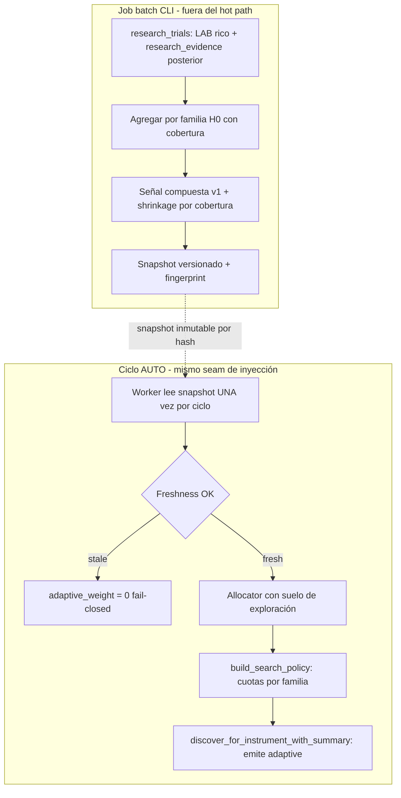

# RELEVO — V2.37 · Hardening de V2.36 + Adaptive Discovery Generation — 2026-09-11

> **Para el agente entrante (con sus subagentes).** Este documento es autocontenido: asume
> **cero contexto previo** más allá de lo que aquí se dice. Léelo entero antes de tocar nada.
> Respeta el estilo del repo: español, fail-closed, sin LLM en hot path, LIVE congelado.
>
> **AsOf:** 2026-09-11 · **Base:** `v2.36-beta` (`main == cb147d89`).
> **Alembic head:** `037_discovery_evidence_freshness` (migración aditiva nueva).
> **Bump:** `1.61.0-beta` → `1.62.0-beta`.
> **Flags:** `AUTO_ORCHESTRATOR_ADAPTIVE_ALLOCATOR` y `AUTO_ORCHESTRATOR_ADAPTIVE_GENERATION`
> **OFF por defecto**; con ambos OFF el sistema es byte-idéntico a `v2.36-beta`.

---

## 0. Estado en una frase

Se cierran los tres P2 de la auditoría de `v2.36-beta` (evidencia demasiado simple, cota de
explotación implícita, snapshot sin freshness) y se habilita la **emisión adaptativa real**:
el carril `adaptive`, que en v2.36 solo recibía cupo observable, ahora puede **decidir qué
familias del catálogo reciben oportunidades de búsqueda**, con exploración garantizada,
determinismo y todos los gates intactos.

---

## 1. Diagrama del bucle



---

## 2. Qué se ha implementado (mapa fichero → responsabilidad)

| Capa       | Fichero                                                  | Responsabilidad                                                                                                                     |
| ---------- | -------------------------------------------------------- | ----------------------------------------------------------------------------------------------------------------------------------- |
| Dominio    | `entities/discovery_evidence_snapshot.py`                | `MATH_VERSION_DISCOVERY_EVIDENCE_V1`, `evidence_fingerprint`, `is_fresh()`, doc de las tres identidades.                            |
| Dominio    | `repositories/research_trial_repository.py`              | Protocol ampliado: `posterior_evidence_summary`.                                                                                    |
| Aplicación | `discovery_evidence.py`                                  | Señal compuesta v1 (componentes monótonos + cobertura neutral), `evidence_fingerprint`, `familyGranularity`, versión v0 preservada. |
| Aplicación | `discovery_catalog.py`                                   | `exploration_floor_ratio` + enforcement del suelo de exploración en `allocate`.                                                     |
| Aplicación | `discovery_search_policy.py`                             | **Nuevo**: `SearchPolicy` (cuotas por familia, explotación top-k + exploración uniforme).                                           |
| Aplicación | `strategy_discovery_engine.py`                           | **Emisión adaptativa real** (`ADAPTIVE_FAMILY_PREFIX`), `search_policy` inyectable, contadores en el resumen.                       |
| Infra      | `repositories/research_trial_repository.py`              | `family_evidence_summary` con Sharpe/PF/drawdown + cobertura; `posterior_evidence_summary` por nivel ADR-012.                       |
| Infra      | `repositories/discovery_evidence_snapshot_repository.py` | Persiste/lee `evidence_fingerprint`.                                                                                                |
| Infra      | `alembic/versions/037_discovery_evidence_freshness.py`   | Columna aditiva `evidence_fingerprint`, `downgrade()` completo.                                                                     |
| App        | `scripts/build_discovery_evidence_snapshot.py`           | Usa v1, une posterior, `--math-version`, reporta fingerprint.                                                                       |
| App        | `background/auto_orchestrator_worker.py`                 | Freshness fail-closed, flag de generación, construcción/inyección de la política, contadores.                                       |

---

## 3. Decisiones cerradas (y su porqué)

1. **Señal v1 con cobertura neutral.** Renormalizar sobre las métricas presentes premiaba la
   ausencia; puntuar 0 castigaba la ausencia. La solución correcta es _shrinkage_ hacia un ancla
   neutral 0.5 con peso = cobertura observada. Lo bueno observado > ausente > malo observado.
2. **Suelo de exploración explícito.** La cota `max_adaptive_weight` sola no impedía que el
   adaptive absorbiera la exploración cuando el resto de pesos eran bajos. El suelo
   (`exploration_floor_ratio`) es una política formal, testeable, no un comentario.
3. **Freshness por tiempo de evento.** La vigencia se mide sobre `window_to`, no sobre `created_at`:
   un snapshot recién persistido sobre evidencia vieja sigue siendo evidencia vieja.
4. **Tres identidades documentadas.** `snapshot_hash` (conocimiento), `id` (instancia), `created_at`
   (persistencia): evita leer "snapshot más nuevo" como "conocimiento más reciente".
5. **La emisión adaptativa reutiliza el catálogo.** No se añade espacio de búsqueda (nada de
   combinaciones nuevas): la inteligencia decide _dónde_ mirar dentro de lo ya declarado.
6. **Fail-closed en todo el camino.** Sin snapshot, stale, sin cupo o sin política ⇒ el carril no
   emite y el ciclo es el de v2.36. Nunca una hipótesis inventada.
7. **Dos flags separados.** `..._ADAPTIVE_ALLOCATOR` (cupo) y `..._ADAPTIVE_GENERATION` (emisión)
   permiten un rollout por etapas; el provider se cablea si cualquiera está ON.

---

## 4. Fórmula de la señal v1 (auditable)

- Componentes en `[0, 1]`: `is_score → 1 - exp(-max(0, score))`; `sharpe → tanh(sharpe)`;
  `profit_factor → 1 - exp(-(pf-1))`; `drawdown → exp(-dd/50)`; `posterior → weighted/count`;
  `success_ratio = (trials - zeroTrade - failures) / trials`.
- Pesos: `is_score 0.30`, `success_ratio 0.20`, `sharpe 0.15`, `posterior 0.15`,
  `profit_factor 0.10`, `drawdown 0.10`.
- `observed` = media ponderada de los componentes presentes; `coverage` = peso presente / total;
  `strength = coverage × observed + (1 - coverage) × 0.5`.
- `adaptive_weight = clamp(mean(strength) × max_adaptive_weight, 0, max_adaptive_weight)`.
- `math_version = "discovery_evidence_v1"`; la v0 se conserva reproducible para snapshots históricos.

---

## 5. Invariantes respetadas

- `AUTO ⇒ SIMULATED`; **LIVE bloqueado**; **sin LLM en hot path**; fail-closed; long-only.
- H1 (`require_holdout=True` inviolable) y H2 (identidad de dataset) intactos.
- Gates CPCV/PBO/DSR/WFE/OOS + coach sin relajar.
- Test anti-explosión `len(plans) == 1784` intacto.
- Con los flags OFF, todo es **byte-idéntico a v2.36**.

---

## 6. Verificación ejecutada (tres bloques, local)

```
# Bloque 1 — estático
uv run ruff check packages/py apps/api-python --config pyproject.toml     # All checks passed
uv run lint-imports --config packages/py/.importlinter                     # 4 kept, 0 broken
uv run mypy ... --follow-imports=silent                                    # Success: 475 files

# Bloque 2 — offline
uv run pytest packages/py/domain/tests packages/py/application/tests \
  apps/api-python/tests/test_auto_orchestrator_worker.py -q                # 1547 passed

# Bloque 3 — PG con gates
$env:A14_GRAMMAR_PG_REQUIRED="1"; $env:LIFECYCLE_PG_REQUIRED="1"; $env:AUTO_ORCHESTRATOR_PG_REQUIRED="1"
uv run pytest test_a11... test_a14... test_discovery_evidence_snapshot_pg.py -q   # 12 passed
uv run pytest apps/api-python/tests/test_discovery_evidence_snapshot_pg.py -q     # 10 passed
uv run pytest apps/api-python/tests/test_strategy_lifecycle_pg.py -q              # 6 passed
```

---

## 7. Pendiente / siguiente paso

1. Elevación: commit en `main`, tag `v2.37-beta`, Release-tag CI.
2. Granularidad efectiva `family + regime + parameter region + instrument class` (el payload ya
   publica `familyGranularity`; falta que el repo agregue por clave compuesta).
3. Persistir `search_policy_hash`/`lane` por trial para ponderar por carril real.
4. Vigilancia de la política adaptativa en producción (rollout por etapas con los dos flags).
