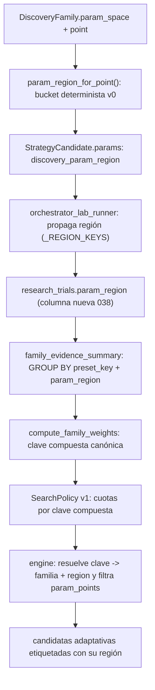

# RELEVO — V2.38 · Granularidad por región de parámetros (incremento 3) — 2026-09-11

> **Para el agente entrante (con sus subagentes).** Este documento es autocontenido: asume
> **cero contexto previo** más allá de lo que aquí se dice. Léelo entero antes de tocar nada.
> Respeta el estilo del repo: español, fail-closed, sin LLM en hot path, LIVE congelado.
>
> **AsOf:** 2026-09-11 · **Base:** `v2.37-beta` (`main == 13020eeb`).
> **Alembic head:** `038_research_trials_param_region` (migración aditiva nueva).
> **Bump:** `1.62.0-beta` → `1.63.0-beta` → `1.63.1-beta` (hotfix de auditoría).
> **Flag:** `AUTO_ORCHESTRATOR_ADAPTIVE_PARAM_REGION` **OFF por defecto**; con OFF el
> ciclo es **equivalente** a `v2.37-beta` (ver §0bis).
>
> ⚠️ **ADDENDUM V2.38.1 (hotfix de la auditoría de V2.38).** El claim original
> "byte-idéntico a V2.37 con OFF" era inexacto y ya está corregido. Ver §0bis antes de
> dar por bueno cualquier razonamiento de esta versión.

---

## 0bis. Hotfix V2.38.1 — correcciones de la auditoría (leer SIEMPRE)

La auditoría externa de `v2.38-beta` (`41b96a41`, CI GREEN) dio **8,9/10** con **P2 = 2**.
Ambos están cerrados en `1.63.1-beta`:

1. **P2-01 — equivalencia con V2.37.** El write-path etiquetaba la región **siempre**, así
   que con OFF el snapshot contenía regiones y `_collapse_regions` colapsaba con `max(peso)`
   (≈ 7,4 % de divergencia: `0.747` vs `0.803`). **Fix**: el motor recibe
   `emit_param_region` (dependencia inyectada) y el worker lo pone a
   `adaptive_param_region_enabled()`. Con OFF **no se genera región** ⇒ evidencia idéntica a
   V2.37 y colapso no-op. `_collapse_regions` sigue existiendo para evidencia histórica.
2. **P2-02 — determinismo del `evidence_fingerprint`.** Ordenaba solo por `presetKey`;
   ahora por clave compuesta `(presetKey, paramRegion)`.

**Consecuencia para el agente entrante:** si tocas el write-path o el colapso, respeta que
la equivalencia con V2.37 se garantiza por la **ausencia de grano** cuando el flag está OFF,
**nunca** por el colapso. Audit-pack: `audit-pack-v2.38.1-hotfix-audit-2026-09-11.md`.

---

## 0. Estado en una frase

Tercer incremento de Strategy Intelligence: la evidencia adaptativa deja de agregarse solo
por **familia H0** y pasa a granularidad por **región de parámetros** dentro del grid de la
familia (clave compuesta `familia|region`), con bucket determinista y versionado, columna
nueva nullable en `research_trials` (migración aditiva) y filtrado de la emisión adaptativa
al punto concreto. Régimen e **instrument class quedan fuera** porque **no existen como dato
persistido** (ver §6).

---

## 1. Diagrama del flujo nuevo



---

## 2. Qué se ha implementado (mapa fichero → responsabilidad)

| Capa            | Fichero                                                                    | Responsabilidad                                                                                                                   |
| --------------- | -------------------------------------------------------------------------- | --------------------------------------------------------------------------------------------------------------------------------- |
| Aplicación      | `application/discovery_param_region.py` (**nuevo**)                        | Bucket determinista v0, `compose`/`split` de la clave compuesta, etiqueta legible. Núcleo puro, sin DB/red/LLM.                   |
| Aplicación      | `application/discovery_evidence.py`                                        | `compute_family_weights` mintea la clave compuesta; `evidence_fingerprint` incluye `paramRegion`; `familyGranularity` real.       |
| Aplicación      | `application/discovery_search_policy.py`                                   | `MATH_VERSION_SEARCH_POLICY_V0` → `discovery_search_policy_v1`; `GRANULARITY_KEY_VERSION_V0` en el hash y metadata.               |
| Aplicación      | `application/strategy_discovery_engine.py`                                 | Etiqueta candidatas (catálogo y adaptive); resuelve clave compuesta y filtra `param_points()` a la región; contadores.            |
| Aplicación      | `application/orchestrator_lab_runner.py`                                   | `_REGION_KEYS = {discovery_param_region}`: propaga la región (antes se descartaba).                                               |
| Aplicación      | `application/optimization_runs.py`                                         | `_param_region_for_trial()`: pasa la región a `insert_trial(param_region=...)`. Fail-closed ⇒ `None`.                             |
| Dominio         | `entities/research_trial.py` + `repositories/research_trial_repository.py` | `ResearchTrial.param_region: str\|None`; Protocol `insert_trial(..., param_region=...)`.                                          |
| Infraestructura | `database/models/tables.py`                                                | `ResearchTrialRow.param_region`.                                                                                                  |
| Infraestructura | `database/repositories/research_trial_repository.py`                       | `_normalized_region`; agregación `GROUP BY preset_key, param_region`; posterior por clave compuesta.                              |
| Infraestructura | `alembic/versions/038_research_trials_param_region.py` (**nuevo**)         | Columna nullable, sin backfill, `downgrade()` completo, guards idempotentes.                                                      |
| App (API)       | `scripts/build_discovery_evidence_snapshot.py`                             | Merge de la evidencia posterior por clave compuesta.                                                                              |
| App (API)       | `background/auto_orchestrator_worker.py`                                   | Flag `adaptive_param_region_enabled()`, `_collapse_regions()`, contador `adaptive_region_emissions`, logs `adaptive_regions=N/M`. |

---

## 3. Cómo verificar (comandos exactos)

```bash
# Calidad (los ficheros tocados)
uv run ruff check <ficheros tocados>
uv run mypy <módulos tocados>

# Offline (hermético)
uv run pytest packages/py/domain/tests packages/py/application/tests \
  apps/api-python/tests/test_auto_orchestrator_worker.py -q

# PG con gates
$env:A14_GRAMMAR_PG_REQUIRED="1"
uv run pytest apps/api-python/tests/test_discovery_evidence_snapshot_pg.py -q

# Job batch (auditar el bucket antes de activar nada)
uv run python apps/api-python/scripts/build_discovery_evidence_snapshot.py --dry-run
```

Alembic (desde `packages/py/infrastructure`):

```bash
uv run alembic -c alembic.ini upgrade head
```

---

## 4. Qué NO se ha tocado (invariantes)

- `AUTO ⇒ SIMULATED`; LIVE bloqueado; sin LLM en hot path; fail-closed; long-only.
- H1 (`require_holdout=True`) y H2 (identidad de dataset) intactos.
- Gates CPCV/PBO/DSR/WFE/OOS + coach sin relajar.
- Test anti-explosión `len(plans) == 1784` intacto (solo se etiqueta).
- Con el flag OFF, byte-idéntico a `v2.37-beta`.

---

## 5. Cabos sueltos / notas para el entrante

- **`lint-imports` no se pudo ejecutar** en la máquina de esta sesión (Windows Application
  Control bloquea el binario, `os error 4551`). Los cuatro contratos se revisaron manualmente
  contra `packages/py/.importlinter`: `bolsa_domain` no gana imports nuevos y `bolsa_ai` no
  entra en `domain`. **Volver a ejecutarlo en CI/otra máquina.**
- **`ruff` del repo tiene deuda preexistente** (~493 errores fuera del alcance); los ficheros
  tocados pasan limpios. No se ha reformateado nada fuera de alcance.
- **Cuatro tests de `packages/py/infrastructure/tests`** (`chaos/test_load_concurrency_flow.py`
  y `test_f3a_account_data_migration.py`) fallan en esta máquina por estado/concurrencia de la
  BD de desarrollo; **no tocan `research_trials`** ni el código de esta fase.
- **Fingerprint**: `evidence_fingerprint` incluye ahora `paramRegion` (cadena vacía cuando no
  hay región), así que la huella cambia respecto a v2.37 incluso sin región. Es **datos**
  evaluados por snapshot, no forma del hash: el `snapshot_hash` sigue siendo idéntico.
- **`regime`/`instrument_class`** siguen sin persistirse; no se han inventado (§6).

---

## 6. Por qué régimen e instrument class quedan fuera (decisión explícita)

- **Régimen**: solo existe como clasificación en memoria en
  `packages/py/analytics/src/bolsa_analytics/cognitive/market_state.py`; **jamás** se escribe
  en `research_trials`/`research_evidence`. Etiquetar trials con un régimen calculado a
  posteriori sería inventar el dato.
- **Instrument class**: `InstrumentRow.type` usa `INSTRUMENT_TYPE_ENUM = ENUM("stock")` con un
  solo valor y `sector` es texto libre sin poblar. El concepto real ("equities") solo vive en
  Trading Policy, sin join a research.

Incorporarlos exige **primero persistirlos como fuente de verdad**; `compose_granularity_key`
admite nuevos componentes sin romper el contrato.

---

## 7. Próximos pasos sugeridos

1. **Elevar `v2.38-beta`**: commit de sellado, tag `v2.38-beta` y Release-tag CI (verde).
2. Valorar persistir **régimen** por trial (el mayor valor analítico de los dos que faltan).
3. Valorar poblar **`instruments.type`/`sector`** para habilitar la clase de instrumento.
4. Persistir `lane`/`grammar_plan`/`search_policy_hash` por trial para ponderar por carril real.
