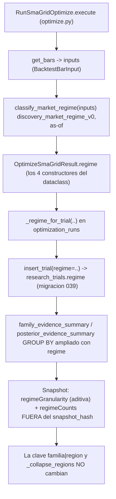

# RELEVO — V2.39 · Régimen de mercado por trial (incremento 4) — 2026-09-11

> **Para el agente entrante (con sus subagentes).** Este documento es autocontenido: asume
> **cero contexto previo** más allá de lo que aquí se dice. Léelo entero antes de tocar nada.
> Respeta el estilo del repo: español, fail-closed, sin LLM en hot path, LIVE congelado.
>
> **AsOf:** 2026-09-11 · **Base:** `v2.38.1-beta` (`main == 7c499cfc`).
> **Alembic head:** `039_research_trials_regime` (migración aditiva nueva).
> **Bump:** `1.63.1-beta` → `1.64.0-beta`.
> **Flag:** `AUTO_ORCHESTRATOR_ADAPTIVE_REGIME` **OFF por defecto**; con OFF el ciclo es
> **equivalente** a `v2.38.1-beta` (ver §0bis).

---

## 0. Estado en una frase

Cuarto incremento de Strategy Intelligence: la evidencia gana la segunda dimensión de
granularidad que V2.38 dejó apuntada, el **régimen de mercado** bajo el que se evaluó cada
trial, derivado de las **propias barras del trial** (as-of, determinista y versionado),
persistido en una columna nueva nullable `research_trials.regime` (migración aditiva `039`)
y publicado como **dimensión paralela** observable (`regimeGranularity` / `regimeCounts`).
**No entra** en el reparto de cupos ni en la clave `familia|region`.

---

## 0bis. Por qué un régimen derivado de barras (leer SIEMPRE antes de tocar)

El régimen macro cognitivo existente **NO es utilizable en el trial**:
`bolsa_analytics.cognitive.market_state.build_market_state` se alimenta de
`bolsa_market.macro_snapshot.fetch_macro_snapshot_dict`, que usa valores _live_ de Yahoo
(`date.today()`, `closes[-1]`) y **no persiste serie histórica**. Etiquetar un trial pasado
con el régimen de hoy sería inventar dato — exactamente lo que V2.38 evitó.

El régimen de V2.39 se deriva de las barras que el LAB ya tiene en el punto del trial
(`RunSmaGridOptimize.execute`), con corte as-of en la última barra de la ventana. Es
aritmética pura: determinista, reproducible y sin dependencias externas.

**Consecuencia para el agente entrante:** NO sustituyas el clasificador de barras por el
régimen macro cognitivo, ni lo alimentes de un feed _live_. Si algún día se quiere el
régimen macro as-of, primero hay que **persistir su serie histórica** como fuente de verdad.

---

## 1. Diagrama del flujo nuevo



---

## 2. Tabla capa → fichero → responsabilidad

| Capa           | Fichero                                                                                       | Responsabilidad en V2.39                                                                                                                                                                                              |
| -------------- | --------------------------------------------------------------------------------------------- | --------------------------------------------------------------------------------------------------------------------------------------------------------------------------------------------------------------------- |
| Núcleo puro    | `packages/py/application/src/bolsa_application/discovery_market_regime.py`                    | Clasificador determinista `discovery_market_regime_v0`: un solo eje `trend_up`/`trend_down`/`range`/`high_vol`, as-of, fail-closed. `MATH_VERSION_MARKET_REGIME_V0`, `TRIAL_REGIMES`, `NO_REGIME`, `is_valid_regime`. |
| Tests núcleo   | `packages/py/application/tests/test_discovery_market_regime.py`                               | 17 tests herméticos: determinismo, fail-closed (pocas barras, NaN, high-low ausentes, precios degenerados, math_version desconocida), sensibilidad a tendencia/volatilidad, orden/as-of.                              |
| Migración      | `packages/py/infrastructure/alembic/versions/039_research_trials_regime.py`                   | Columna `regime String NULL` aditiva, sin backfill, `downgrade()` completo, guards idempotentes. `down_revision = 038`.                                                                                               |
| Modelo/entidad | `tables.py` · `entities/research_trial.py`                                                    | `ResearchTrialRow.regime` · `ResearchTrial.regime` (nullable).                                                                                                                                                        |
| Persistencia   | `domain/.../research_trial_repository.py` · `infrastructure/.../research_trial_repository.py` | `insert_trial(..., regime=)` + mapeo `_map` + agregación por régimen.                                                                                                                                                 |
| LAB            | `packages/py/application/src/bolsa_application/optimize.py`                                   | Campo `OptimizeSmaGridResult.regime`; cálculo con `classify_market_regime(...)` en los 4 constructores (`_finalize`, `_run_cpcv`, `_run_walk_forward`, `_run_declarative_partial_on_bars`).                           |
| Write-path     | `packages/py/application/src/bolsa_application/optimization_runs.py`                          | `_regime_for_trial` (fail-closed, fallback a `params`/`blocks`); `emit_regime` en `execute` y `_persist_optimize_research_trials`.                                                                                    |
| Runner         | `packages/py/application/src/bolsa_application/orchestrator_lab_runner.py`                    | `emit_regime` en `_LAB_RUN_KEYS`; fijado por el composition root tras los overrides (una candidata no puede encenderlo).                                                                                              |
| Evidencia      | `packages/py/application/src/bolsa_application/discovery_evidence.py`                         | `regime` en el `evidence_fingerprint` (orden `presetKey, paramRegion, regime`); `regimeGranularity` en el payload, fuera del `snapshot_hash`.                                                                         |
| Rollout        | `apps/api-python/src/bolsa_api/background/auto_orchestrator_worker.py`                        | Flag `AUTO_ORCHESTRATOR_ADAPTIVE_REGIME` (OFF), `adaptive_regime_enabled()`, `log_regime_rollout_state()`, inyección de `emit_regime`.                                                                                |
| CI             | `.github/workflows/python-ci.yml` · `release-tag-ci.yml`                                      | Cableado de `test_discovery_market_regime.py` en ambos jobs.                                                                                                                                                          |
| PG             | `apps/api-python/tests/test_discovery_evidence_snapshot_pg.py`                                | Roundtrip de régimen, agregación por régimen, `regimeCounts` posterior, migración `039` upgradable/downgradable.                                                                                                      |

---

## 3. Comandos exactos de verificación

```bash
# Calidad (INVOCACIÓN EXACTA DE CI: el root cambia la clasificación de imports — lección v2.38)
uv run ruff check packages/py apps/api-python --config pyproject.toml
uv run mypy <módulos tocados>

# Tests puros (herméticos) de V2.39
uv run pytest packages/py/application/tests/test_discovery_market_regime.py \
  packages/py/application/tests/test_discovery_evidence.py \
  packages/py/application/tests/test_optimization_runs.py \
  apps/api-python/tests/test_auto_orchestrator_worker.py -q

# Certificación PG (skip = fallo). Requiere migrate a head ANTES.
cd packages/py/infrastructure && uv run alembic upgrade head && cd ../../..
uv run pytest apps/api-python/tests/test_discovery_evidence_snapshot_pg.py -q

# Equivalencia con el flag OFF: los tests de rollout lo cubren
#   test_emit_regime_false_persists_no_regime
#   test_regime_does_not_change_snapshot_hash_vs_no_regime
```

Resultados obtenidos (local): ruff `All checks passed` · mypy Success · V2.39 offline
**212 passed** · PG **18 passed**.

---

## 4. Invariantes que NO se tocan

`AUTO ⇒ SIMULATED` · LIVE bloqueado · sin LLM en hot path · fail-closed · H1/H2 · long-only ·
gates CPCV/PBO/DSR/WFE/OOS sin relajar · anti-explosión `len(plans) == 1784` · **la clave
compuesta `familia|region` y `_collapse_regions` sin modificar** · con el flag de régimen
OFF, comportamiento idéntico a V2.38.1.

---

## 5. Cabos sueltos (deuda declarada)

1. **Multiplicación de cubos (R2).** El régimen añade una dimensión a la agregación; con
   pocos trials por cubo la evidencia se dispersa. Mitigación en V2.39: el régimen **no**
   entra en el reparto de cupos, solo en observabilidad/agregación; fail-closed (`""`) cuando
   las barras son insuficientes.
2. **Dos caminos de agregación.** `family_evidence_summary` y `posterior_evidence_summary`
   deben mantenerse coherentes (ya pasó en V2.38).
3. **`package.json` raíz** estaba desincronizado (`1.52.0-beta`); corregido a `1.64.0-beta`
   en este incremento. Vigilar que no vuelva a divergir del `CHANGELOG`.
4. **Tests de chaos/migración F3a.** `test_load_concurrency_flow.py` y
   `test_f3a_account_data_migration.py` fallan por contaminación de estado de BD en corridas
   completas (preexistente, ajeno a V2.39: no tocan `research_trials`). Se dejan como están.

---

## 6. Decisiones explícitas

- **Fuente del régimen:** barras del propio trial (as-of), NO el macro cognitivo (no
  calculable as-of; ver §0bis).
- **Un solo eje:** cuatro etiquetas mutuamente excluyentes; `high_vol` tiene prioridad.
- **Dimensión paralela:** el régimen NO se incorpora a la clave `familia|region` (rompería
  `_collapse_regions` y la compatibilidad V2.37/V2.38). Se publica aparte.
- **Sin reparto:** el régimen no influye en `compute_family_weights` ni en la search policy
  en V2.39 (queda lista para un consumo futuro).
- **Rollout off por defecto:** `emit_regime` lo fija el composition root; una candidata no
  puede encenderlo (test dedicado).
- **Equivalencia real con OFF:** con OFF no se calcula régimen ⇒ trials a `NULL` ⇒ evidencia
  idéntica a V2.38.1. La equivalencia se garantiza por la vía del write-path, no por un
  colapso posterior (lección del P2-01 de V2.38.1).

---

## 7. Próximos pasos

1. **Sellado:** commit de fase + commit documental, tag `v2.39-beta`, push, verificar
   **Release-tag CI GREEN** (`certify`) y referenciar el run.
2. **Auditoría externa** sobre el tag sellado, usando
   `audit-pack-v2.39-regimen-por-trial-2026-09-11.md` como punto de entrada.
3. **Valorar** (no en V2.39): consumo del régimen en el reparto de cupos (requiere masa
   crítica de trials por cubo) y `instrument class` (requiere persistirse como dato).
