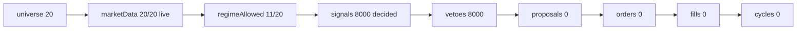

# Cierre de la ventana PAPER D1..D4 — `NO MEDIDO` (objeto `v2.85.2-beta`)

> **AsOf:** 2026-09-28 · **Objeto:** tag `v2.85.2-beta` (`2.10.2-beta`, docs-only) · **Cuenta PAPER:**
> `1484e253d2d54645945a6b1d7` · **Árbol de código:** freeze `apps`
> `ddcf636f39054e29cf9013e0273da2b773c1fd76` / `packages` `ba90ccf233bce9bada4e41cf81eb0b69312fd0d1`
> (idéntico a `v2.85`/`v2.85.1`: este objeto **no** lo mueve).
> **Veredicto:** ventana **`NO MEDIDO`** por **veto legítimo de régimen**, no por fallo de código.
> **Evidencia cruda (dentro del tag):** [`evidence/v2.85.2/`](./evidence/v2.85.2/README.md).

## 1. Qué pasó el 2026-09-28 (D1)

El forward `v2_76` corrió **400 ticks completos** (`--interval-seconds 60 --max-ticks 400`,
`stopReason=completed`) y **no escribió un solo fill**. El agregado del par A/B:

| Métrica | Valor | Fuente |
|---|---|---|
| `decided` (par A+B) | **8000** (400 ticks × 20 símbolos) | `turnTotals` |
| `proposals` / `orders` / `fills` / `opened` / `closed` | **0 / 0 / 0 / 0 / 0** | `turnTotals` |
| `vetoes` (par A+B) | **8000** | `turnTotals` |
| `vetoCounted` (censo del journal, versión A) | **4000** = `regime_invalid:2000` + `top_n_excluded:2000` | `topVetoCodes` / `vetoByBucket` |
| `otherCount` / `contractViolation` | **0** / **false** | `vetoByBucket` |
| `state` / `measured` | **`vetoed`** / **true** | `operability_state` |
| Régimen | `aggregateTrialRegime=trend_down` ⇒ `operationalRegime=BEAR_TREND` ⇒ `entriesAllowedLong=false` | `marketRegime` |
| Conteo por símbolo | `{range: 8, trend_down: 9, trend_up: 3}` (20 símbolos) | `marketRegime.counts` |
| Símbolos operables | **11 / 20** | `symbolsOperable` |
| Precios | `market_live` **20 / 20** | `priceSources` |
| Par A/B | `pairActive=true` (`v283-window-a` / `v283-window-b`) | `pairActive` |

**Diagnóstico (el escalón donde el caudal pasa a 0):** el funnel se detiene en **`regimeAllowed`**. Con
`BEAR_TREND` las entradas LONG de los símbolos `trend_down`/`trend_up` se vetan con **`regime_invalid`**; los
símbolos `range` pasan el régimen pero quedan fuera por **`top_n_excluded`**. Sin propuestas no hay
órdenes, sin órdenes no hay fills, sin fills no hay ciclos ⇒ **0 material durable**.



## 2. Por qué el `v2_80` no pudo leer la ventana (causa medida)

`v2_80_market_window.py:210` construye los días de la ventana como
`days = sorted(set(fills_by_day) | set(cycles_by_day) | set(journal_by_day))`, **solo material durable** de
PostgreSQL. Para esta cuenta las tres tablas están **vacías** ⇒ `exit 2` («no hay ningún día de
operabilidad que leer en la ventana»). El `--forward` **no crea días: solo enriquece los que ya existen**
⇒ correr D2..D4 con el mismo régimen **no cambiaría nada**. Por eso la ventana se cierra como **`NO MEDIDO`**
y **no** se rebajaron `min cycles`/`min R`/`folds`/`min_episodes` ni se forzaron entradas.

## 3. Por qué tardó tanto (cronología real, recomputable desde la evidencia)

Del log [`forward-20260928.out.log`](./evidence/v2.85.2/forward-20260928.out.log) (40 informes de progreso):

| Hito | Hora (UTC) | Nota |
|---|---|---|
| Arranque (PID 2400) | `08:38:08` | |
| tick 10 | `08:47:12` | |
| tick 230 | `12:28:06` | |
| **tick 240** | `13:35:25` | **salto de `67m19s`** (nominal `10m`) — suspensión del equipo |
| tick 400 | `16:16:19` | |
| Pipeline detecta la salida | `16:16:49` | encadena `v2_77`/`v2_80`/`v2_83`/readiness |

- **Cadencia medida:** 10 ticks cada `~10m02s` ⇒ **`~60.2 s/tick`**, exacta a la pedida.
- **Total:** `7h 38m 41s` frente al **nominal `6h 40m`** (400 × 60 s).
- **Sobrecoste ≈ `58 min` = la suspensión del equipo** (el salto 230→240). El motor **no** es la causa.

Tres causas, en orden de peso:

1. **Por construcción:** `60 s × 400 ticks = 6h40m`. Es el diseño «reloj real, 1 tick = 1 minuto».
2. **`--stop-when-ready` no puede cortar:** con `BEAR_TREND` los ciclos medibles son **0**, así que nunca se
   alcanza `--level evidence` (≥32 ciclos/estrategia) y **siempre corre los 400 ticks completos**.
3. **El `--out` solo se escribe al final:** no hay evidencia parcial; se pagaron ~7h por un resultado que ya
   era legible desde el tick 10 (veto de régimen).

**Consecuencia operativa declarada:** la ventana ≥4 días exige **4 cubos de calendario** (`created_at` de
material durable), es decir ~4 corridas repartidas en ≥4 días reales (`~4 × 7h` de reloj). Mientras el
régimen vete, ese tiempo **no produce material**: construir primero el material (barras frescas ⇒ régimen
operable) es la operación correcta, no alargar la cadencia.

## 4. Observación nueva medida — `OBS-13` (LOW, instrumento/diagnóstico)

Al recomputar la evidencia aparece una **asimetría no declarada** entre `vetoes` y `vetoCounted`:

- `vetoes = 8000` (totales del **par** A+B, 20 símbolos/tick).
- `vetoCounted = 4000` = **solo la versión A** (`watchA`, 10 símbolos/tick): los **5 `trend_down`** de
  `watchA` ⇒ `regime_invalid:2000` (`5 × 400`) y los **5 `range`** de `watchA` ⇒ `top_n_excluded:2000`
  (`5 × 400`). Los **7 vetos de régimen + 3 `range`** de `watchB` **no** entran en el censo.
- **Causa medida:** `_journal_reasons` lee `runtime.worker._v2_journal`, el journal del **worker primario**
  (versión A). La versión B corre por `secondary` (`SplitWatchDecider`) y **no** aporta a ese censo.
- **`contractViolation=false`** no lo detecta: solo mide `other > 0`; la brecha A/B es invisible al contrato.

**No es un bloqueante** (el veto es legítimo y el veredicto `NO MEDIDO` no cambia), pero un auditor que
compare la columna `Veto` con las familias verá el factor `×2`. Se declara como **`OBS-13` (LOW)** y queda
**ABIERTA** (exige tocar el seam de diagnóstico; fuera del alcance docs-only de este re-sello).

## 5. Cadena de lectura para reproducir

```powershell
# 1) serie diaria del funnel (función pura sobre la evidencia del tag)
uv run --no-sync python apps/api-python/scripts/v2_77_market_operability.py `
    --forward docs/engineering/evidence/v2.85.2/forward-market-20260928.json --render

# 2) la ventana durable NO existe para esta cuenta (3 tablas vacías) => exit 2 declarado
uv run --no-sync python apps/api-python/scripts/v2_80_market_window.py --days 4
```

## 6. Declarado, no hecho

`P3-2`/`P3-3` (ventana PAPER **real** ≥4 días **con material**), `OBS-11`, `H-4`, `OBS-9`, `P3-5`, `OBS-5`
y la nueva **`OBS-13`** siguen **ABIERTAS**. Este cierre **no** las cierra: exigen datos PAPER reales o un
cambio de código, no documentación.
