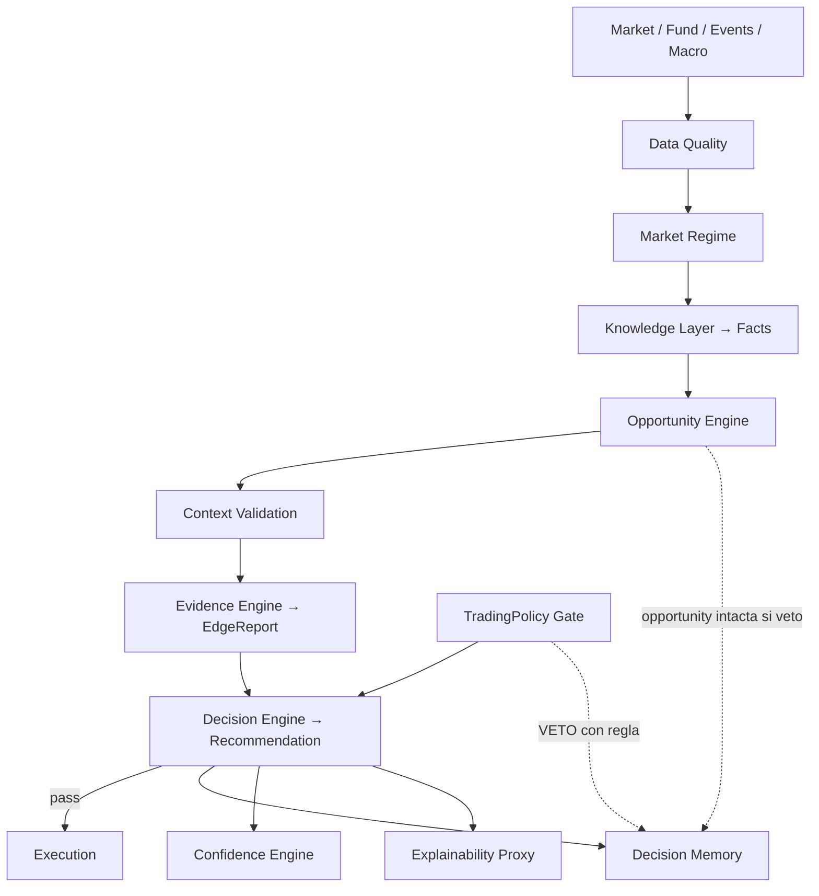

# RFC-008: Cognitive Decision Architecture

> **Propósito:** Definir **cómo decide Bolsa V1** — el modelo de decisión desde el dato hasta la posición — antes de ampliar indicadores o modelos.  
> **Efecto:** Todo desarrollo de trading automático/supervisado, scoring multimodal, Evidence Engine y explicabilidad **debe** ajustarse a este RFC.  
> **Estado:** `approved` (2026-07-22) — **no se reabre**. Enmiendas posteriores van como §21 (Amendment).  
> **Congelación:** no nuevas oleadas IND-* hasta **D2 en curso** (Knowledge Layer + DecisionPackage TA-only).  
> **Principio constitucional (inalterable):** LLM / ML → especificación o predicción; el motor determinista calcula, audita y ejecuta. Ningún modelo generativo envía órdenes ni calcula PnL.  
> **Qué construimos:** un **Sistema de Decisión Financiera**. La IA es un asesor (explicación / conflictos narrativos), no el centro.

**Origen:** Consenso A1/A3 (aprobación) + enmiendas A2 (pipeline jerárquico) + Amendment-1 (A3 2026-07-23: Market State, métricas cuádruples, Conviction, Decision Case) + Amendment-2 (Assessment común / Evidence→Assessment→Decision).

---

## 1. Cambio de paradigma

| Antes (error común) | Bolsa V1 (este RFC) |
|---------------------|---------------------|
| Indicadores → “IA” → Compra | Indicadores → **Facts** → **Evidence** → **Opportunity** → **Prediction** → **Decision** → Execution |
| Una IA predice la bolsa | Un **Decision Engine** (reglas, stats, ML, LLM solo explicación) |
| Comité plano que “vota” | **Pipeline jerárquico** de puertas sí/no + evidencias tipadas |
| News ≈ RSI en el mismo voto | Niveles distintos: oportunidad ≠ validación de contexto ≠ permiso |
| Perfil = preferencia estética | **InvestorProfile** (quién soy) ≠ **TradingPolicy** (qué está permitido) |
| Confianza fija en la señal | **Confidence Lifecycle** mientras la tesis / posición vive |

Lenguaje preferido en docs/código nuevo: **Decision Engine**, no “la IA”.  
Dentro del Decision Engine pueden coexistir modelos estadísticos, reglas, ML, optimizadores y (solo en Explainability) un LLM vía Proxy.

Preguntas del sistema (jerárquicas, no simultáneas):

```text
¿Datos íntegros? → ¿Régimen operable?
→ ¿Hay oportunidad (TA + Fund)?
→ ¿Sigue válida tras contexto (Eventos + Macro + Risk)?
→ ¿Cuánto puedo creerme la señal (Evidence / Edge)?
→ ¿La TradingPolicy lo permite?
→ ¿Qué Recommendation emitir? → ¿Cómo ejecutar / explicar?
```

---

## 2. Cinco niveles operativos (nunca al revés)

```text
Usuario
   ↓
InvestorProfile          (quién es; no habla del mercado)
   ↓
TradingPolicy            (manual operativo hard; existe sin Decision Engine)
   ↓
Decision Engine          (evidencias → Recommendation; no órdenes)
   ↓
Execution Engine         (sizing, stops, Intent → Order → Position)
```

| Nivel | Habla de | No habla de |
|-------|----------|-------------|
| InvestorProfile | Objetivos, horizonte, aversión, experiencia; Declared ≠ Observed | RSI, “comprar Apple” |
| TradingPolicy | Universo, liquidez, eventos, riesgo, ejecución, umbrales Edge | Prompts LLM |
| Decision Engine | Facts, Evidence, Opportunity, Prediction, Recommendation | Broker fills |
| Execution | Position sizing, stops, paper/live | Reinterpretar tesis |

---

## 3. Pipeline jerárquico (sustituye el “comité que vota”)

Los roles de evidencia **no votan en igualdad**. Cada etapa responde una pregunta y puede cortar el flujo.

```text
MARKET
   │
   ▼
Data Quality Engine ──────────── ¿datos íntegros? ─── no → STOP
   │ sí
   ▼
Market Regime Engine ─────────── ¿se puede operar? ── no → STOP / wait
   │ sí
   ▼
Opportunity Engine (TA + Fund) ─ ¿hay oportunidad? ── no → STOP
   │ sí  (OpportunityEvidence; puede ser excelente)
   ▼
Context Validation Engine ────── ¿sigue válida? ───── no → STOP
   │ (MarketEvents + Macro + Risk hints)
   ▼
Evidence Engine ──────────────── ¿cuánto creerla? ─── bajo → block auto / reduce
   │
   ▼
Trading Policy Gate ──────────── ¿está permitido? ─── no → VETO (oportunidad intacta)
   │ sí
   ▼
Decision Engine → Recommendation / DecisionPackage
   │
   ▼
Position Management → Order Execution
```

### 3.1 Opportunity ≠ Permission

Una oportunidad puede ser 95/100 y aun así **no estar permitida** (p. ej. earnings en 48h).  
**No** se mezcla restando puntos: se conserva `OpportunityEvidence` y el Policy Gate registra `VETO` con regla explícita.

### 3.2 Capas cognitivas (mapa)

| # | Capa | Responsabilidad | Determinista |
|---|------|-----------------|--------------|
| 1 | **Investor Profile** | Declared + Observed (separados) | Datos + reglas |
| 2 | **Trading Policy** | Manual operativo hard | 100% |
| 3 | **Market Knowledge Layer** | Indicadores/datos → Facts | 100% |
| 4 | **Opportunity Engine** | ¿Existe oportunidad interesante? (TA+Fund) | 100% (scores) |
| 5 | **Context Validation** | Eventos + Macro + Risk: ¿sigue válida? | 100% |
| 6 | **Evidence Engine** | Credibilidad / skill vs luck + decay | 100% (stats) |
| 7 | **Decision Engine** | Prediction + gates → Recommendation | Scores + WeightRules |
| 8 | **Confidence Engine** | Lifecycle de confianza de la tesis | 100% (+ eventos) |
| 9 | **Execution Engine** | Intent → Order → Position | 100%; sin import AI |
| 10 | **Explainability** | Traducir DecisionPackage | Solo `AIGovernanceProxy` |
| 11 | **Decision Memory** | Por qué se aceptó/rechazó; reevaluación | Persistencia + reglas |



---

## 4. Lenguaje ubicuo (enmienda RFC-000)

| Término | Significado | No confundir con |
|---------|-------------|------------------|
| **InvestorProfile** | Identidad: `declared` + `observed` (nunca fusionados automáticamente) | TradingPolicy |
| **TradingPolicy** | Manual operativo hard (universo, liquidez, eventos, riesgo, ejecución, Edge) | Preferencias de UI |
| **Fact** | Afirmación interpretable (“tendencia primaria fuerte”) | RSI=72 crudo |
| **Evidence** | Objeto tipado: claim + direction + weight + confidence + validity + decay | Opinión de modelo |
| **Opportunity** | Resultado del Opportunity Engine: hay/no hay setup interesante | Permiso de operar |
| **MarketEvent** | Noticia/fundamental/macro estructurado (no párrafo) | Resumen LLM suelto |
| **Prediction** | Creencia sobre el futuro | Decisión de operar |
| **Recommendation** | Qué hacer bajo Policy+Risk+Evidence | Order |
| **EvidenceRole** | Módulo que emite un tipo de Evidence | LLM autónomo / voto |
| **DecisionPackage** | Envelope cerrado + breakdown + refs | Solo “BUY” |
| **EdgeReport** | Credibilidad estadística (WFO, DSR/PSR, MC, …) | Winrate aislado |
| **ConfidenceState** | Confianza viva de una tesis/posición | Score estático |
| **DecisionMemory** | Registro de accept/reject + motivos + triggers de reevaluación | Solo OHLCV history |

Cadena canónica:

```text
Features → Facts → OpportunityEvidence → ContextEvidence
        → StatisticalEvidence (Edge) → Prediction
        → Recommendation
        → Policy Gate
        → Intent → Order → Position
        → Confidence Lifecycle + Decision Memory
```

---

## 5. Artefactos (enmienda RFC-001)

| Tipo | ID | Dominio | Notas |
|------|-----|---------|--------|
| Investor Profile | `ART-PROFILE` | `PORTFOLIO` / `POLICY` | Catálogo `investor_profiles`; cuenta → `active_profile_id`; Declared + Observed |
| Trading Policy | `ART-TRADING-POLICY` | `POLICY` | Hard sandbox; SemVer; plantillas |
| Market Fact Set | `ART-FACT-SET` | `RUNTIME` | Salida Knowledge Layer |
| Evidence Bundle | `ART-EVIDENCE-BUNDLE` | `RUNTIME` | Evidencias tipadas + decay |
| Edge Report | `ART-EDGE-REPORT` | `RESEARCH` / `OBS` | Gates paper→live |
| Decision Package | `ART-DECISION-PACKAGE` | `PORTFOLIO` | Recommendation + breakdown |
| Confidence State | `ART-CONFIDENCE-STATE` | `PORTFOLIO` | Lifecycle tesis abierta |
| Decision Memory | `ART-DECISION-MEMORY` | `OBS` / `PORTFOLIO` | Accept/reject + reevaluación |

Lifecycle: RFC-001. **Auto-live** exige `ART-EDGE-REPORT` adecuado + Policy que lo referencie.

---

## 6. InvestorProfile vs TradingPolicy

### 6.1 InvestorProfile — Declared ≠ Observed

| Parte | Origen | Uso |
|-------|--------|-----|
| **Declared** | Cuestionario / usuario | Horizonte, objetivos, aversión, experiencia |
| **Observed** | Comportamiento medido | Impulsividad, overtrading, desviación vs Policy |

**Prohibido:** que el sistema reescriba el perfil declarado o la Policy porque el usuario “actúa agresivo”.  
**Permitido:** mostrar divergencia (“tu comportamiento no coincide con tu política”) sin mezclar ambos.

Nunca incluye listas de indicadores ni “usar SuperTrend”.

**Persistencia (catálogo, no embebido):** filas en `investor_profiles`; cada `investment_accounts.active_profile_id` referencia el perfil activo.  
`settings_json` **no** transporta el perfil (clave `investorProfile` eliminada en migración `20260723020000_investor_profiles_catalog`).  
API: `/api/investor-profiles` (CRUD) + assign a cuenta. El Policy Gate resuelve la plantilla desde el perfil activo, no desde settings.

### 6.2 TradingPolicy — manual operativo

La Policy es un **sandbox infranqueable**. Bloques v1:

| Bloque | Ejemplos |
|--------|----------|
| Universo | asset classes, índices (Nasdaq/S&P/EU), large/mid/small, excluded sectors/tickers, shorting |
| Liquidez | min ADV USD, max spread bps, ATR min/max |
| Exposición | max leverage, max positions, concentration %, sector %, correlación máx. |
| Riesgo | risk/trade, daily/weekly DD, hard DD, min R:R, stop obligatorio |
| Eventos / blackouts | FED, ECB, CPI, PMI, NFP, earnings, M&A, dividends, splits + ventanas h |
| Horizonte | primary TF, min/max holding |
| Ejecución | market / limit / stop / TWAP / VWAP / iceberg (preferencias permitidas) |
| Evidencia | min EdgeScore / max MC p / min WFE / min Credibility para auto |

Plantillas: `conservative` | `moderate` | `aggressive_swing` | `custom` (fork versionado).

### 6.3 WeightRules (no pesos fijos)

```text
inputs: horizon, regime, policyId, optional assetClass
output: weights { ta, fund, news, macro, … } + vetos contextuales
```

Scalping → fund≈0; swing largo → fund alto; crisis → macro/risk dominan.  
Los pesos **no** igualan jerarquía: Context/Policy pueden invalidar sin “votar”.

---

## 7. Market Knowledge Layer

**No calcula** indicadores (Feature Registry). **Interpreta** → Facts.

| Entrada | Fact |
|---------|------|
| ADX alto + DI+ > DI− | `trend.primary = strong_bullish` |
| RSI alto sin divergencia | `momentum = strong`, `exhaustion = false` |
| OBV + ruptura | `participation = institutional_bias` |
| Gaps / calidad baja | `data_quality = degraded` (veto posible) |

---

## 8. Evidence tipada (todo produce evidencia, no opiniones)

Cada módulo entrega un objeto estructurado. El Decision Engine pregunta: **¿qué evidencia aportas?**

| Tipo | Emisor típico |
|------|----------------|
| `DataQualityEvidence` | Data Quality Engine |
| `MarketRegimeEvidence` | Regime Engine |
| `TechnicalEvidence` / **TechnicalAssessment** | Knowledge TA — Assessment tipado; score + **bias** (bullish/bearish/neutral), no BUY (§22) |
| `FundamentalEvidence` | Opportunity (Fund) |
| `OpportunityEvidence` | Opportunity Engine |
| `NewsEvidence` / `MarketEventEvidence` | Context (eventos) |
| `MacroEvidence` | Context |
| `RiskEvidence` | Risk |
| `PolicyEvidence` | Policy Gate (PASS/VETO + regla) |
| `StatisticalEvidence` | Evidence Engine (Edge / Credibility) |

Campos comunes:

| Campo | Rol |
|-------|-----|
| `claim` | Qué se afirma |
| `evidenceKind` | Tipo tipado |
| `direction` | supports \| contradicts \| neutral |
| `weight` | Tras WeightRules / etapa |
| `confidence` | Credibilidad del método/fuente |
| `validFrom` / `validTo` | Ventana |
| `decayHalfLife` | Vida útil |
| `refs` | featureIds, eventId, edgeReportId |

### 8.1 Evidence Engine — “¿cuánto puedo creerme esta señal?”

No solo “¿funciona?”. Emite **Credibility** / EdgeScore a partir de:

| Prueba | Uso |
|--------|-----|
| Walk-Forward Efficiency (WFE) | Degradación IS→OOS |
| PSR / **DSR** | Sharpe vs suerte + **N trials** |
| Monte Carlo permutation | p-value vs azar |
| Bootstrap alfa | IC del exceso |
| Stress / regime | Cisnes negros |
| Paper / shadow | Promoción live; anti look-ahead |

Ejemplo: WinRate histórico + WFE + MC + Bootstrap + PSR + DSR → **Credibility** agregada (0–100) y semáforo 🟢/🟡/🔴.  
Sin registro de trials (N), el DSR **no es válido**.

---

## 9. MarketEvent (noticias → eventos estructurados)

Una noticia **no** entra como párrafo. Se normaliza a:

```text
entity, eventType, sentiment, impact, horizon, affects[], source, credibility, validTo
```

Ej.: NVDA / earnings / positive / very_high / 3w / semiconductors / Reuters / 0.98.

---

## 10. Prediction ≠ Decision

| Objeto | Pregunta | Puede ser alto y aun así… |
|--------|----------|---------------------------|
| **Prediction** | ¿Qué puede ocurrir? | …no operar |
| **Recommendation** | ¿Qué hacemos bajo Policy+Risk+Evidence? | Wait / reduce / veto |

Motivos válidos de no operar: R:R, liquidez, Policy, blackout, Edge/Credibility baja, Confidence degradada.

---

## 11. EvidenceRoles (módulos deterministas; no 9 LLMs)

| Role | Pregunta | Veto |
|------|----------|------|
| `data_quality` | ¿Datos OK? | Sí fail-fast |
| `regime` | ¿Régimen operable? | Sí / wait |
| `opportunity` | ¿Hay oportunidad (TA+Fund)? | No (solo “no hay”) |
| `technical` / `fundamental` | Evidencias de oportunidad | No |
| `context_events` / `macro` | ¿Sigue válida? | Puede invalidar |
| `risk` | ¿Cabe en riesgo? | **Sí absoluto** vs Policy |
| `evidence` | ¿Credibilidad suficiente? | Sí para auto-live |
| `policy` | ¿Permitido? | **Sí absoluto** |

**Prohibido:** multi-LLM deliberativo que vote LONG/SHORT.  
**Permitido:** un LLM (Proxy) que **traduce** un `DecisionPackage` ya cerrado.

---

## 12. Confidence Lifecycle

```text
confidence_0 (DecisionPackage)
  → MarketEvent / régimen / invalidator
  → update confidence (+ hold / tighten / exit hint)
  → expiry → caduca
```

No exige recomputar todo el pipeline en cada tick.

---

## 13. Decision Memory

Registra por qué se **aceptó** o **rechazó** una oportunidad y qué debe disparar reevaluación.

Ejemplo: rechazó MSFT por earnings → al cerrar la ventana de blackout, el motor **reconsidera** sin perder el contexto.

Campos mínimos: `opportunityRef`, `outcome` (accepted|rejected|deferred), `reasons[]`, `policyRuleIds[]`, `reevaluateWhen[]`, `timestamps`.

---

## 14. DecisionPackage

- `decisionId`, `instrumentId`, `timestamp`  
- `opportunityRef`, `predictionRef`  
- `action`: recommend_long \| recommend_short \| wait \| reduce \| exit_hint  
- `overallConfidence`, **`conviction`** (potencial esperado; distinto de confidence)  
- `consensus`, `evidenceStrength`, `stability` (véase §21)  
- `edgeScore` / `credibility`  
- `suggestedExecution` (hints; Execution ajusta bajo Policy)  
- `complianceCheck` (policyId, PASS/FAIL por regla)  
- `evidenceBreakdown[]` (kind, score, weight, claims, invalidators)  
- `factSetRef`, `edgeReportRef`, `profileSnapshotRef`, `policyVersion`, `memoryRef`  
- `decisionCaseRef` (expediente opcional; §21)

Explainability **no muta** estos campos.  
**Recommendation ≠ Conviction:** p. ej. BUY + confidence alta + conviction baja = tesis clara, payoff pequeño.

---

## 15. Policy Gate (único permiso de apertura auto)

Orden:

1. Data quality / regime fail-fast  
2. Opportunity (+ context validation)  
3. Evidence / Credibility thresholds (modo auto)  
4. TradingPolicy hard rules  
5. Risk sizing / correlación  
6. Emit DecisionPackage → supervised / auto paper|live Intent  
7. Escribir Decision Memory

Violación → **VETO** + audit; la oportunidad permanece en memoria para reevaluación.

---

## 16. Relación con RFCs existentes

| RFC | Relación |
|-----|----------|
| 000 | Términos §4 |
| 001 | Nuevos `ART-*` §5 |
| 005 | Features → Knowledge; no son la decisión |
| 006 | Lineage DecisionPackage / Edge / Evidence / Memory |
| 007 | Único camino LLM = explicación / authoring |

Caps (enmienda RFC-002 al implementar):  
`CAP-PROFILE`, `CAP-TRADING-POLICY`, `CAP-KNOWLEDGE`, `CAP-OPPORTUNITY`, `CAP-EVIDENCE`, `CAP-DECISION`, `CAP-CONFIDENCE`, `CAP-DECISION-MEMORY`.

---

## 17. Roadmap

| Fase | Entregable | Hecho cuando |
|------|------------|--------------|
| **D0** | Este RFC `approved` | ✅ 2026-07-22 |
| **D1** | ART-PROFILE catálogo + ART-TRADING-POLICY + 3 plantillas + UI | ✅ 2026-07-22 · catálogo PG ✅ 2026-07-23 |
| **D2.1** | Knowledge Layer TA → `ART-FACT-SET` | ✅ Features → Facts |
| **D2.2** | Score_TA | ✅ Score técnico [-1, +1] desde Facts |
| **D2.3** | DecisionPackage TA-only | ✅ Primera Recommendation real |
| **D2.4** | Policy Gate sobre DecisionPackage | ✅ PASS/VETO + Decision Memory stub |
| **D3** | Validation / Evidence Engine v1 + ART-EDGE-REPORT | ✅ PSR/DSR + TrialsLog + auto-live block |
| **D4** | MarketEvents + decay + vetos Policy + Gate hot path | ✅ Eventos + `ExecutionRouter` paper_auto |
| **D5** | Fundamental → Score_FUND en Opportunity | ✅ Facts FUND + Opportunity TA+FUND |
| **D6** | Macro + WeightRules + Market State completo | ✅ Score_MACRO + régimen + WeightRules horizonte+régimen + Context Validation v1 |
| **D7** | Confidence Lifecycle + Observed Profile + panel Efectividad | ✅ ART-CONFIDENCE-STATE + observe + `/api/ai/effectiveness` + UI Ayuda |
| **D7++** | Observed → PG + perfil default cuenta | ✅ `observed_json` + refresh; `EnsureDefaultInvestorProfile` |
| **F3*** | Recommendation Proposal | ✅ TA+FUND+Macro+News(Yahoo)+Evidence → Runtime → Recommendation; Gate pasivo; **DecisionSession** en propose |
| **F4*** | Circuit breaker drawdown + manifests | ◐ Hard*Drawdown (EquityMarkBook + settings_json.equityMarks); paperAutoManifest; live dry-run |

**Orden consensuado (2026-07-23):** D2 Knowledge → DecisionPackage → **entonces** Gate (A1); Gate sin package es incompleto (A2 acepta como D2.4).  
**IND-\*:** congelados hasta D2 **en curso** (D2.1 arranca la descongelación controlada).

---

## 18. Anti-patrones (bloqueados)

| Prohibido | En su lugar |
|-----------|-------------|
| 9 LLMs votando órdenes | Roles deterministas + 1 LLM explicador |
| Comité plano TA=Fund=News | Pipeline jerárquico Opportunity → Context → Evidence → Policy |
| “85% aciertos” como prueba | EdgeScore / Credibility (WFO, DSR, MC, N trials) |
| Más IND-* como decisión | Knowledge → Opportunity → Evidence → Decision |
| Pesos fijos universales | WeightRules + jerarquía de gates |
| Mezclar Profile y Policy | Dos artefactos |
| Fusionar Declared y Observed | Dos vistas; alertar divergencia |
| Mezclar Opportunity y Permission | OpportunityEvidence + PolicyEvidence separados |
| Mezclar Prediction y Decision | Dos objetos |
| Mezclar Recommendation y Conviction | Dos métricas |
| LLM en hot path / LLM que “decide” sin evidencias | Proxy solo explicación; Decision Engine determinista |
| Confianza inmutable post-entrada | Confidence Lifecycle |
| Olvidar rechazos | Decision Memory + reevaluación |
| Pesos estáticos globales | WeightRules / modelo de pesos contextual |

---

## 19. Criterios de aceptación del RFC

- [x] Tres auditorías: A1/A3 `approved`; A2 enmiendas incorporadas (pipeline, Opportunity, Memory, Declared/Observed)  
- [x] README rfc/ lista RFC-008  
- [x] AI_PLATFORM_SOLUTION apunta a RFC-008  
- [x] Congelación IND-* hasta D2 en curso  
- [x] Amendment-1 (A3): Market State, métricas cuádruples, Conviction, Decision Case documentados  
- [x] Amendment-2: Assessment común + Evidence→Assessment→Decision + Runtime colección  

---

## 20. Historial

| Fecha | Cambio |
|-------|--------|
| 2026-07-22 | Draft inicial — consenso capas Knowledge / Evidence / Confidence / Prediction≠Decision |
| 2026-07-22 | **Approved** — A1+A3; enmiendas A2: pipeline jerárquico, Opportunity Engine, Opportunity≠Permission, Declared≠Observed, Decision Memory, evidencias tipadas, TradingPolicy como manual operativo |
| 2026-07-23 | **Amendment-1** — A3: Sistema de Decisión (no “una IA”); Market State; Confidence/Consensus/EvidenceStrength/Stability; Recommendation≠Conviction; Decision Case; perfil 5 dims (evolución); roadmap D2.1–D2.4 → Gate |
| 2026-07-23 | **Amendment-2** — Assessment envelope común; TechnicalAssessment no decide; DecisionRuntime colección; trío Evidence≠Assessment≠Decision |

---

## 21. Amendment-1 — Modelo cognitivo enriquecido (2026-07-23)

RFC-008 **permanece approved**. Esta sección incorpora deltas de la auditoría arquitectónica sin reescribir D1.

### 21.1 Seis motores (mapa de nombres)

| Motor | Función | Ya cubierto por |
|-------|---------|-----------------|
| **Market State Engine** | Régimen / contexto **antes** del TA | ✅ D6 — `build_market_state` / WeightRules v2 |
| **Evidence Engine** | Datos → evidencias tipadas (corazón) | Knowledge + Evidence (§7–8); Validation stats = submódulo |
| **Decision Engine** | Integra evidencias, conflictos → Recommendation | §3 / §14; scores deterministas |
| **Risk & Policy Engine** | Profile + TradingPolicy; veto | Policy Gate (§15) |
| **Validation Engine** | Skill vs luck (WFO, MC, DSR…) | Evidence Engine stats / D3 |
| **Execution Engine** | Paper / supervised / live | §2 nivel 5 |

### 21.2 Cuatro métricas de decisión (no solo “confianza”)

| Métrica | Pregunta |
|---------|----------|
| **Confidence** | ¿Estoy seguro de la tesis? |
| **Consensus** | ¿Los motores de evidencia coinciden? |
| **Evidence Strength** | ¿Cuánta evidencia hay (cobertura / peso)? |
| **Stability** | ¿La decisión cambiaría con perturbaciones leves? |

### 21.3 Decision Case (expediente)

Artefacto lógico (puede materializarse como `ART-DECISION-CASE`): Evidence + Conflicts + Statistical validation + Analogues + Risk + Profile compatibility + Expected payoff + Alternatives + Final recommendation. Auditable y reproducible.

### 21.4 Perfil — cinco dimensiones (evolución D1→D7)

Las plantillas conservative/moderate/aggressive_swing siguen siendo **atajos**. El modelo completo separa: (1) Riesgo (2) Horizonte (3) Filosofía (value/growth/momentum/…) (4) Restricciones (→ TradingPolicy) (5) Conducta (Observed; nunca fusionar con Declared).

### 21.5 LLM / IA en Decision Engine

La IA **no calcula** scores. Puede **narrar conflictos** entre evidencias ya computadas (Explainability / authoring). Cualquier “interpretación” que altere `action` debe ser regla determinista versionada o quedar fuera del hot path.

---

## 22. Amendment-2 — Assessment común + trío Evidence/Assessment/Decision (2026-07-23)

RFC-008 **permanece approved**. Esta enmienda fija la base constitucional antes de Fund/News/EvidenceEngine como consumidores del Runtime.

### 22.1 Trío innegociable

| Concepto | Qué es | Qué no es |
|----------|--------|-----------|
| **Evidence** | Observación tipada (hechos, claims, refs) | Decisión operativa |
| **Assessment** | Interpretación estructurada de evidencia (score, confidence, facts, warnings) | BUY / SELL |
| **Decision** | Acción propuesta (`recommend_*` / `wait`) en `DecisionPackage` | Mezcla de indicadores |

```text
OHLCV → FeatureSet → Evidence → Assessment(s) → DecisionRuntime
        → DecisionPackage + Recommendation → Policy Gate → Execution
```

Analogía médica: radiografía → informe → diagnóstico. El motor TA es el radiólogo: emite informe (`TechnicalAssessment`), no la orden de quirófano.

### 22.2 Contrato `Assessment` (envelope común)

Campos base (Python `Assessment` / TS `AssessmentV1`):

| Campo | Rol |
|-------|-----|
| `assessmentId` | Identidad auditable |
| `type` | `technical` \| `fundamental` \| `macro` \| `news` \| `sentiment` \| `evidence` |
| `score` | Contribución direccional [-1, +1] — **no** es la acción |
| `confidence` | Credibilidad de la interpretación |
| `facts[]` | Narrativa / claims |
| `warnings[]` | Riesgos de la lectura |
| `metadata` | Extensiones del motor (bias, components, …) |

Especializaciones **extienden** el envelope (p. ej. `TechnicalAssessment` añade `bias`, `components`, `coverage` y se proyecta con `as_assessment()` / `technicalToAssessment()`).

### 22.3 DecisionRuntime — colección, no un motor

```text
TechnicalAssessment
FundamentalAssessment   ┐
MacroAssessment         ├── Assessment[]  →  DecisionRuntime v1.1  →  DecisionPackage
NewsAssessment          │   (WeightRules; Evidence no vota dirección)
EvidenceAssessment      ┘
TradingPolicy (Gate aparte)
```

- Exige al menos un `type=technical`.
- v1.1: fusiona TA+FUND+MACRO; distress/crisis/tradability invalidan long; Evidence modula confianza.
- Sustituir Technical Engine V1→V4 **no** cambia el Runtime ni el endpoint `propose`.
- Opportunity Engine **delega** al Runtime (ya no construye `action`).
- El Policy Gate **verifica** (propose = pasivo; `paper_auto`/`live` = hard VETO). No reescribe la recomendación.

### 22.4 Recommendation = objeto de negocio

La Recommendation deja de ser “RSI → BUY”. Es producto del Runtime: `action`, confianza/métricas, refs a assessments, estado de política. La UI separa **Assessment** (sesgo/facts) de **Recommendation** (acción).

*Fin RFC-008 (approved + Amendment-1 + Amendment-2).*
